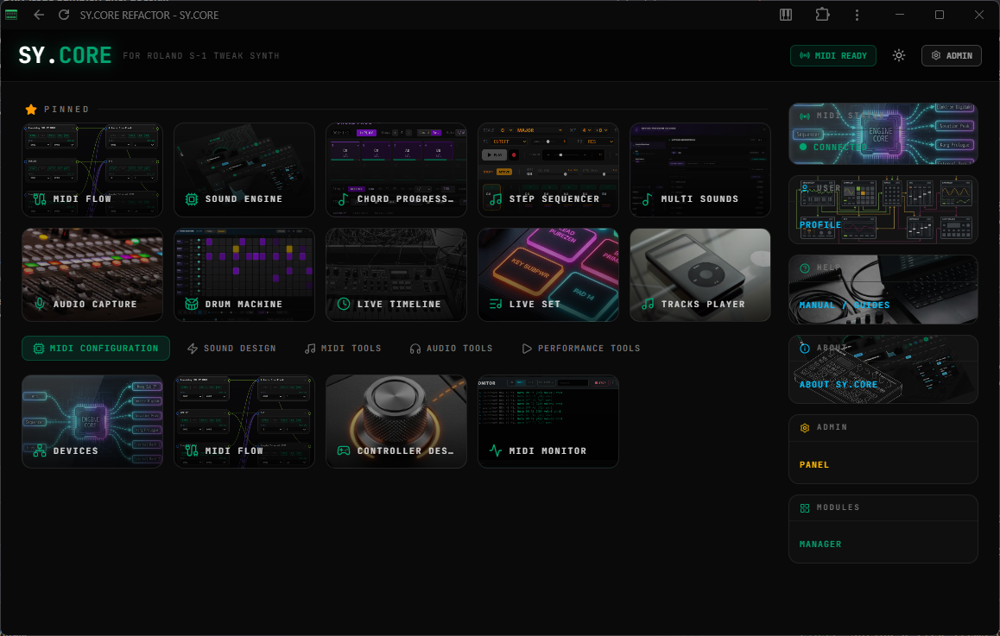

# SY.CORE



> A browser-based performance tools & sound design ecosystem for electronic musicians.

🌐 **[Website](https://swina.github.io/sycore-refactor/)**

SY.CORE is a professional-grade, local-first web application that serves as a centralized hub for MIDI orchestration, sound design, audio processing, and live performance — all running in your browser with no installation required.

---

## Features

### Sound Engine
- **Roland S-1 Adaptive Generator** — preset identity management, real-time parameter control, modulation, and performance integration with the Roland S-1 Tweak Synth.
- **Generative Patch Creation** — create new sounds instantly based on musical parameters.
- **Unlimited Preset Library** — store, categorize, and recall thousands of sounds beyond the hardware's 64-pattern limit.

### Audio Tools
- **Audio Capture** — record audio directly within SY.CORE via the mic toolbar panel.
- **Audio Looper** *(Beta)* — sample-accurate 8-track looper for live instrumental and digital performance.
- **Samples Machine** — 24-pad simultaneous loop player with sync-quantized starts, mixer, Performance Sets, and Capture integration.
- **Sampler** *(Beta)* — 7-pad multi-bank sampler with MIDI velocity, chromatic pitch-shifting, ADSR envelopes, lo-fi modes, and granular synthesis.
- **Backing Track Player** — dual-slot playback engine with crossfade, playlist, and MIDI sync.
- **Freesound Browser** — search, preview, and inject sounds from [freesound.org](https://freesound.org) into playlists, loop pads, or Audio Capture.

### MIDI Tools
- **Devices** — auto-discover and register your MIDI hardware, plus Virtual Instruments (software synths reachable through a virtual MIDI cable) with a bindable real output port.
- **Flow** — visual drag-and-drop MIDI routing canvas for connecting virtual apps and hardware devices. Supports device→app and app→app routing with per-connection note-range filters (keyboard splits), multi-channel fanout for multi-timbral virtual instruments (e.g. duplicate one part onto CH 1, 2 and 4), one-click shortcuts to open a routed app or a device's Program Change panel straight from its canvas node, and named saved canvas configurations that auto-restore on reopen.
- **Controller Designer** — visual canvas for designing custom MIDI controller layouts with draggable controls and preset management.
- **Monitor** — real-time MIDI event monitoring and logging, one click away from the MIDI Flow canvas footer for checking messages while you wire up routing.
- **MIDI Manager** — unified MIDI control center for routing, mapping, and device management.
- **Mapping** — MIDI CC to application parameter binding.
- **Actions** — per-device app action binding (MIDI CC/Note → high-level actions: start sequencer, toggle looper, change preset).
- **Sync** — cross-subsystem transport synchronization matrix, backed by a single global BPM control that keeps Tone.js playback and outgoing MIDI clock to hardware in lockstep across every synced app.
- **MIDI Capture** — record, view, and export MIDI events in real time.
- **Multi Sound / Program Change Browser** — browse and send Program Change messages to connected devices, organize sounds into custom named banks per device, and import external preset listings (e.g. E-MU Emulator X3 exports).

### Live Performance
- **Live Performance Pad** — pad-based performance panel for triggering sounds and sequences on stage.
- **Live Timeline** — visual arrangement timeline with segments, MIDI markers, and transport control.
- **Step Sequencer** — algorithmic composition and MIDI sequencing engine with style-based generation.
- **Chord Progression Sequencer** — step-based harmonic sequencer with built-in chord library, algorithmic generation, and 8 independent progression slots (A–H) chainable into a longer arrangement. Chord/Arp play mode, chord-strum direction, and arpeggio pattern can all be overridden per step, so a single progression can mix strummed chords and arpeggios freely.
- **Drum Machine** — 8-track 16-step pattern sequencer with A–F sequence banks, Fill, Repeater, style generation, and REC SYNC.

### Platform
- **Module Manager** — enable or disable individual app modules to keep the workspace focused on what you actually use; disabled modules are hidden from every toolbar, dock, and quick-launcher.

---

## Tech Stack

| Layer | Technology |
|-------|-----------|
| Framework | [Vue 3](https://vuejs.org/) (Composition API + `<script setup>`) |
| Language | [TypeScript](https://www.typescriptlang.org/) |
| State | [Pinia](https://pinia.vuejs.org/) |
| Routing | [vue-router](https://router.vuejs.org/) |
| Build | [Vite](https://vitejs.dev/) |
| Styles | [Tailwind CSS](https://tailwindcss.com/) |
| Icons | [Lucide](https://lucide.dev/) |
| Audio Engine | [Tone.js](https://tonejs.github.io/) / [Web Audio API](https://developer.mozilla.org/en-US/docs/Web/API/Web_Audio_API) |
| MIDI | [Web MIDI API](https://developer.mozilla.org/en-US/docs/Web/API/Web_MIDI_API) / [webmidi.js](https://webmidijs.org/) |
| Audio Export | [lamejs](https://github.com/zhuker/lamejs) (MP3 encoder) |
| Persistence | IndexedDB / LocalStorage |
| PWA | [vite-plugin-pwa](https://vite-pwa-org.netlify.app/) |
| Backend / Data | [Upstash Redis](https://upstash.com/) / [Vercel KV](https://vercel.com/docs/storage/vercel-kv) |

---

## Hardware Integration

SY.CORE is pre-calibrated for low-latency performance with professional gear:

- **Roland AIRA Series** (S-1 Tweak Synth, T-8 Beat Machine, J-6 Chord Synth) — deep integration with preset management, parameter control, and Program Change automation.
- **Arturia MicroFreak** *(coming soon via SY.CORE LAB)* — unlimited preset management and deep editing.
- **Any USB-MIDI device** — auto-detection, routing, and mapping.

SY.CORE connects over Web MIDI — plug in your hardware and it's recognized immediately with no drivers or installation.

---

## Why SY.CORE — Benefits & Workflow Scenarios

SY.CORE isn't a single instrument or a single tool — it's the layer that sits between your gear, your DAW-less ideas, and the performance itself. A few concrete scenarios where that pays off:

- **One visual hub for a multi-device rig.** Instead of hunting through each synth's own MIDI settings, drag devices and apps onto the MIDI Flow canvas and draw cables between them. Split one keyboard across a Roland S-1, a soft-synth, and a drum machine using note-range filters — or fan one part out to CH 1, 2, and 4 on a multi-timbral virtual rack — all visually, all applied live as you connect.
- **Compose harmony first, arrangement second.** The Chord Progression Sequencer's 8 independent slots (A–H) let you sketch a verse, chorus, and bridge as separate progressions, then chain them into a full arrangement without losing the ability to edit each section independently. Per-step Chord/Arp overrides mean a single progression can strum some chords and arpeggiate others — no need to bounce between a chord tool and an arpeggiator.
- **A rig that stays in tempo without babysitting.** One global BPM control keeps every synced app — sequencers, the drum machine, outgoing MIDI clock to hardware — locked together. Change tempo from a MIDI CC knob mid-performance and everything follows, instead of hunting down three separate tempo fields.
- **Beyond the hardware's onboard memory.** The Roland S-1 (and other supported gear) ships with a fixed pattern/patch limit — SY.CORE's unlimited preset library and per-device Program Change banks (including imports from external listing formats) mean your sound library isn't capped by what fits on the device itself.
- **A workspace that only shows what you need.** Module Manager lets you disable the tools you're not using for a given session, so a sound-design pass and a live-performance set-up don't have to share the same cluttered toolbar.
- **No install, no drivers, no lock-in.** Everything above runs directly in the browser over the Web MIDI and Web Audio APIs — no ASIO drivers, no installer, always the latest version, and your session state persists locally so closing the tab mid-set is safe. See [SY.CORE Advantages](./docs/guides/SYCORE_ADVANTEGES.md) for the deeper technical case.

---

## Getting Started

### Prerequisites

- **Node.js** >= 20
- **npm** >= 9
- A browser with **Web MIDI API** support (Chrome, Edge, Opera recommended)

### Install

```bash
git clone <repository-url>
cd sycore-refactor
npm install
```

### Run (Development)

```bash
npm run dev
```

Starts on port `4100` (or `VITE_DEV_PORT` if set) using the default IndexedDB database. This is the standard way to run the app.

`npm run dev:refactor` is also available if you need to run this checkout side-by-side with another SY.CORE instance — it uses a different port (`3999`) and a separate IndexedDB database (`sycore_2`) so neither instance clobbers the other's local data.

### Build for Production

```bash
npm run build
```

Output in `dist/`. Deployable to any static host or Vercel.

### Preview Production Build

```bash
npm run preview
```

### Run Tests

```bash
npm test
```

### Deploy

```bash
npm run deploy:app
```

Deploys the app to Vercel.

---

## Architecture

```
┌─────────────────────────────────────────────────────┐
│              Layer 1: User Interface (Vue 3)        │
│  MainPage  │  SynthApp  │  All Panels / Modals      │
└──────────────────────┬──────────────────────────────┘
                       │
┌──────────────────────▼──────────────────────────────┐
│           Layer 2: State Management (Pinia)         │
│  useUiStore  │  useMidiStore  │  usePresetStore     │
│  useMappingStore │ useAuthStore │ useConfigStore    │
│  useLivePadStore │ useArpStore │ useLfoStore        │
└──────────────────────┬──────────────────────────────┘
                       │
┌──────────────────────▼──────────────────────────────┐
│           Layer 3: Core Engines (JS / Web Audio)    │
│  MidiService  │  LooperEngine  │  AudioContext      │
│  useMidiInit  │  useMidiCCListener                  │
│  useControllerManager │  MidiRouting                │
└──────────────────────┬──────────────────────────────┘
                       │
┌──────────────────────▼──────────────────────────────┐
│           Layer 4: Data & Persistence               │
│  IndexedDB           │  LocalStorage                │
└─────────────────────────────────────────────────────┘
```

### Key Design Decisions

- **Offline-First** — everything runs locally in the browser. IndexedDB stores your sound library, playlists, and session state. No internet required during performance.
- **Event-Driven Communication** — components use a custom global event system (`window.dispatchEvent`) for cross-cutting communication without expensive re-renders.
- **Lazy-Loaded Panels** — all panels (Sampler, Sequencer, Drum Machine, etc.) are lazy-loaded and shown/hidden via the UI store, keeping the initial bundle lean.
- **Session Persistence** — every change is saved in real-time. Close the tab and come back exactly where you left off.

---

## Documentation

Detailed guides are available in [`docs/guides/`](./docs/guides/):

- [Manifesto](./docs/MANIFESTO.md) — why SY.CORE exists
- [Guides Index](./docs/guides/INDEX.md) — complete list of all guides
- Sound Engine, Audio, MIDI, and Live Performance guides
- Product overview and advantages

See [`CHANGES.md`](./CHANGES.md) for a running log of new features.

---

## Environment Variables

| Variable | Description |
|----------|-------------|
| `VITE_WEBSITE_URL` | URL for the external website link in the top bar |
| `VITE_DEV_PORT` | Dev server port (used by `dev:refactor` script) |
| `VITE_DB_NAME` | IndexedDB database name override |

---

## License

MIT
