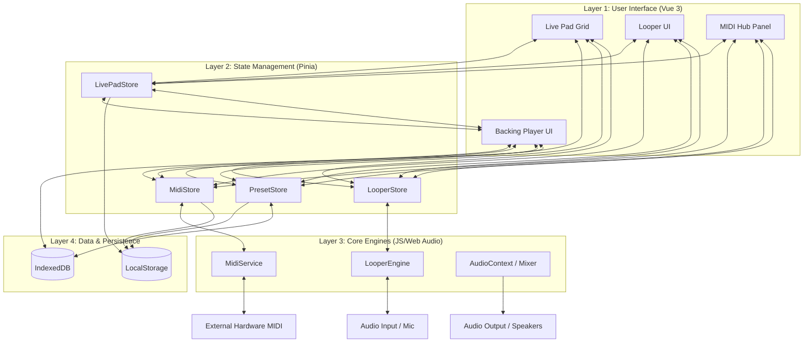

# SY.CORE WebApp: System Architecture & User Guide

SY.CORE is a professional-grade, local-first web application designed for live electronic music performance. It serves as a centralized hub for MIDI orchestration, preset management, and synchronized audio playback.

## 🚀 Core Modules (The Musician's View)

### 1. Live Pad Performance Grid
A high-density 16-pad grid optimized for touch interaction. 
*   **Instant Recall**: Each pad is mapped to a specific synthesizer preset (via MIDI Program Change).
*   **Visual Feedback**: Real-time status indicators show which sound is active and currently playing.
*   **Multi-Engine Control**: Trigger internal sounds or external hardware (like the Roland S-1) with zero latency.

### 2. Backing Track Player & Playlist
A professional playback engine designed for seamless transitions between backing tracks.
*   **Auto-Crossfade**: Smooth transitions between songs with configurable fade times.
*   **Local-First Storage**: Load MP3/WAV files directly into your browser's persistent storage. No internet connection required during the gig.
*   **Intelligent Sync**: The player can broadcast its state to the rest of the app, ensuring your visuals or looper stay in time.

### 3. MIDI Hub & Routing
The "brain" of SY.CORE that connects your hardware to the digital interface.
*   **Device Management**: Automatic detection and connection to USB-MIDI interfaces and instruments.
*   **Program Change Automation**: Automates the switching of sounds across multiple devices simultaneously.
*   **MIDI Syncing**: Centralized BPM clock that keeps the looper, delays, and sequencers perfectly aligned.

### 4. Integrated Audio Looper
An 8-track capture system that allows you to record live instruments and instantly turn them into new tracks in your playlist.
*   **Detailed Guide**: [SYCORE_LOOPER_OVERVIEW.md](./docs/SYCORE_LOOPER_OVERVIEW.md)

---

## 🛠 Technical Architecture (The Developer's View)

### Architecture Diagram
See [SYCORE_ARCHITECTURE.drawio](./docs/SYCORE_ARCHITECTURE.drawio) for the editable diagram.

### 1. Offline-First Philosophy
SY.CORE is designed to survive in high-pressure stage environments without internet.
*   **IndexedDB**: Uses local database technology to store your entire sound library and playlist.
*   **Session Persistence**: Every change to your mixer, volumes, or presets is saved in real-time, so the app resumes exactly where you left off if refreshed.

### 2. Reactive State Management (Pinia)
The app uses a modular **Pinia** store architecture:
*   `useMidiStore`: Manages BPM and hardware connections.
*   `useLivePadStore`: Handles the performance grid and playlist state.
*   `usePresetStore`: Manages the library of synthesizer patches.
*   `useLooperStore`: Tracks recording states and audio buffers.

### 3. Event-Driven Communication
To maintain high performance, components communicate through a custom global event system (`window.dispatchEvent`). This allows the **Looper** to talk to the **Backing Track Player** or the **MIDI Hub** without expensive component re-renders.

---

## 🎹 Hardware Integration
SY.CORE is pre-calibrated for low-latency performance with professional gear, featuring specific optimizations for:
*   **Roland AIRA Series (S-1, T-8, J-6)**
*   **MIDI Pedalboards** (Program Change triggering)
## 🎹 Roland S-1 Advanced Integration

SY.CORE is specifically designed to augment the capabilities of the Roland S-1 Tweak Synth, transforming it from a compact portable synth into a professional studio and stage powerhouse:

*   **Unlimited Sound Library**: Bypass the S-1 hardware limitation of 64 patterns/presets. SY.CORE allows you to store, categorize, and recall thousands of custom sounds directly from your browser.
*   **Zero Menu Diving**: Access deep synthesis parameters that are usually hidden behind button combinations on the hardware. SY.CORE provides a high-fidelity visual interface for real-time sound design.
*   **Generative Sound Engine**: Leverage SY.CORE's built-in generative engine to create new, unique patches instantly based on musical parameters, breathing new life into the S-1's four-voice oscillator.
*   **Performance Macro Controls**: Map multiple S-1 parameters to single touch-friendly controls for complex, expressive performance gestures that are impossible on the hardware alone.

## 🔬 SY.CORE LAB: Future Integrations

SY.CORE is an evolving ecosystem designed to be hardware-agnostic. **SY.CORE LAB** is our dedicated research and development unit focused on porting the core engine to specific hardware synthesizer architectures:

*   **Custom Integrations**: We provide specialized core integration services for professional setups and specific studio requirements.
*   **Coming Soon: Arturia MicroFreak**: SY.CORE LAB has officially started the integration process for the **Arturia MicroFreak**, bringing our unlimited preset management, deep editing, and generative engines to this iconic experimental synth.

## 🛠 Core Technologies (100% Open Source)

SY.CORE leverages cutting-edge, fully Open Source browser technologies and open standards to deliver a near-native audio experience:

*   **[Web Audio API](https://developer.mozilla.org/en-US/docs/Web/API/Web_Audio_API)**: Used for low-latency audio processing, routing, and real-time synthesis.
*   **[Web MIDI API](https://developer.mozilla.org/en-US/docs/Web/API/Web_MIDI_API)**: Enables communication with external synthesizers, controllers, and hardware gear.
*   **[Tone.js](https://tonejs.github.io/)**: A powerful framework built on Web Audio for scheduling and high-level audio manipulation.
*   **[lamejs](https://github.com/zhuker/lamejs)**: A pure JavaScript MP3 encoder used for the looper's export functionality.
*   **[WebMIDI.js](https://webmidijs.org/)**: Simplifies complex MIDI interactions and device management.
