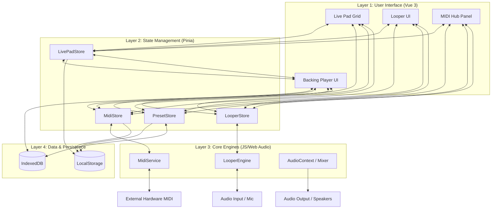

# SY.CORE WebApp: System Architecture & User Guide

SY.CORE is a professional-grade, local-first web application designed for live electronic music performance. It serves as a centralized hub for MIDI orchestration, preset management, and synchronized audio playback.

## 🚀 Core Modules (The Musician's View)

### 1. Live Pad Performance Grid
A high-density 16-pad grid optimized for touch interaction. 
*   **Instant Recall**: Each pad is mapped to a specific synthesizer preset (via MIDI Program Change).
*   **Visual Feedback**: Real-time status indicators show which sound is active and currently playing.
*   **Multi-Engine Control**: Trigger internal sounds or external hardware (like the Roland S-1) with zero latency.

### 2. Backing Track Player & Playlist
A professional playback engine designed for seamless transitions between backing tracks.
*   **Auto-Crossfade**: Smooth transitions between songs with configurable fade times.
*   **Local-First Storage**: Load MP3/WAV files directly into your browser's persistent storage. No internet connection required during the gig.
*   **Intelligent Sync**: The player can broadcast its state to the rest of the app, ensuring your visuals or looper stay in time.

### 3. MIDI Hub & Routing
The "brain" of SY.CORE that connects your hardware to the digital interface.
*   **Device Management**: Automatic detection and connection to USB-MIDI interfaces and instruments.
*   **Program Change Automation**: Automates the switching of sounds across multiple devices simultaneously.
*   **MIDI Syncing**: Centralized BPM clock that keeps the looper, delays, and sequencers perfectly aligned.

### 4. Integrated Audio Looper
(Detailed in `SYCORE_LOOPER_OVERVIEW.md`)
An 8-track capture system that allows you to record live instruments and instantly turn them into new tracks in your playlist.

---

## 🛠 Technical Architecture (The Developer's View)

### 1. Offline-First Philosophy
SY.CORE is designed to survive in high-pressure stage environments without internet.
*   **IndexedDB**: Uses local database technology to store your entire sound library and playlist.
*   **Session Persistence**: Every change to your mixer, volumes, or presets is saved in real-time, so the app resumes exactly where you left off if refreshed.

### 2. Reactive State Management (Pinia)
The app uses a modular **Pinia** store architecture:
*   `useMidiStore`: Manages BPM and hardware connections.
*   `useLivePadStore`: Handles the performance grid and playlist state.
*   `usePresetStore`: Manages the library of synthesizer patches.
*   `useLooperStore`: Tracks recording states and audio buffers.

### 3. Event-Driven Communication
To maintain high performance, components communicate through a custom global event system (`window.dispatchEvent`). This allows the **Looper** to talk to the **Backing Track Player** or the **MIDI Hub** without expensive component re-renders.

### 4. Modern UI Stack
*   **Vue 3 (Composition API)**: For a fast, reactive user interface.
*   **Tailwind CSS + Vanilla CSS**: Optimized for ultra-fast rendering and customized touch-friendly layouts.
*   **Lucide Icons**: High-contrast, scalable iconography for stage visibility.

---

## 🎹 Hardware Integration
SY.CORE is pre-calibrated for low-latency performance with professional gear, featuring specific optimizations for:
*   **Roland AIRA Series (S-1, T-8, J-6)**
*   **MIDI Pedalboards** (Program Change triggering)
*   **Touch-screen Laptops & Tablets** (Surface, iPad via browser)
