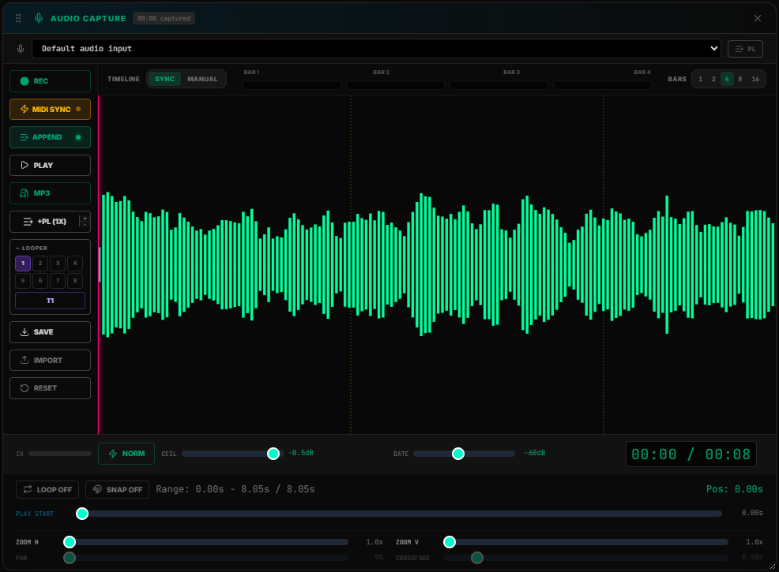

# SY.CORE — Audio Capture

> **Panel:** Audio Capture (`AudioCapture.vue`)  
> **Open via:** Toolbar mic button → `isAudioCaptureOpen`  
> **Keyboard shortcut:** assignable via MIDI learn  
> **Position:** Draggable, persisted in `S1_CAPTURE_POS` (localStorage)

---

## Overview

Audio Capture is a full-featured in-app audio recorder and editor. It records directly from any connected audio input, shows a live waveform during monitoring, and provides an interactive waveform editor with loop, crop, normalize, and export tools — all without leaving SY.CORE.

---

## Interface Layout



```
┌─────────────────────────────────────────────────────────────────┐
│ [≡] 🎙 AUDIO CAPTURE  [REC 00:12] ···················· [✕]    │ ← Header
├───────────────┬─────────────────────────────────────────────────┤
│ [Device ▾] [PL]                                                 │ ← Device bar
├───────┬───────────────────────────────────────────────────────  │
│ REC   │                                                         │
│ MIDI  │         WAVEFORM / OSCILLOSCOPE CANVAS                 │ ← Main area
│ SYNC  │                                                         │
│ PLAY  │    [bar 1][bar 2][bar 3][bar 4]  BPM timeline          │
│ MP3   │    Measures: [1][2][4][8]  SNAP [⊞]  Crossfade [──]  │
│ +PL   │                                                         │
│ →LPR  │  Loop: START [──────────────────] END                  │
│ SAVE  │  Play Start: [──────────────────]                      │
│ IMPRT │  Zoom X [─] 1.0x [+]    Zoom Y [─] 1.0x [+]          │
│ RESET │                                                         │
└───────┴────────────────────────────────────────────────────────-┘
```

---

## Core Concepts

### Three States

| State | Canvas shows | Level bar |
|-------|-------------|-----------|
| **Monitoring** | Live oscilloscope (neon green waveform) | Active |
| **Recording** | Same oscilloscope + red REC dot | Active (turns red when clipping) |
| **Playback / Edit** | Recorded waveform with loop handles | Hidden |

The component manages state through `isMonitoring`, `isRecording`, and `isPlaying` refs. All three can only be active one at a time in practice.

### Web Audio Pipeline

```
getUserMedia → MediaStreamSource → AnalyserNode → (level meter + canvas)
                                 ↓
                           MediaRecorder → chunks[] → Blob → blobURL
                                                             ↓
                                              AudioElement 1 ─┬─→ GainNode 1 ─┐
                                              AudioElement 2 ─┴─→ GainNode 2 ─┴→ destination
```

Dual audio elements (`audioRef1` / `audioRef2`) plus two gain nodes enable **crossfade looping** — when the playhead nears the loop end, the second element begins playing from the loop start while the first fades out.

---

## Features

### Recording

| Control | Behavior |
|---------|----------|
| **REC** | Starts immediately (or arms if MIDI Sync is on) |
| **STOP** | Finalizes the recording; waveform appears |
| **RESET** | Clears everything and restarts monitoring |
| **MIDI Sync** | Arms recording; fires automatically on first incoming MIDI note |

When `hasBackingTrack` prop is true, starting a recording also sends `toggle-backing-track` to start the backing track player in sync.

**MIDI learn:** Right-click the REC button to assign any CC or note via `audioCapture_record` param name.

### Auto-add to Playlist

Toggle the **PL** button in the device bar to automatically send every completed recording to the backing track playlist (dispatches `playlist-add-from-capture` with URL, label, duration, and current BPM).

### MIDI Trigger

Enable **MIDI SYNC** to arm the recorder. A flashing amber **Armed…** button replaces REC. The recording starts as soon as any MIDI note-on arrives. A live pulse dot shows incoming MIDI activity even when not armed.

---

## Waveform Editor

Once a recording exists, the canvas switches to waveform view with 160 amplitude peaks.

### Visual Markers

| Marker | Color | Description |
|--------|-------|-------------|
| Playhead | Neon pink | Current playback position |
| Play Start | Cyan dashed | Where playback begins |
| Loop Start | Green dashed | Start of the loop region |
| Loop End | Red dashed | End of the loop region |
| Bar lines | Yellow dashed | Beat grid derived from current BPM |

Bars inside the active loop region are drawn full-brightness; outside the region they are dimmed.

### Loop Controls

- **LOOP toggle:** Enables looping between Loop Start and Loop End.
- **Loop Start / Loop End sliders:** Set the loop window in seconds.
- **Play Start slider:** Offset where linear (non-loop) playback begins.
- **Snap to Grid:** When enabled, all handle positions are snapped to the nearest bar division calculated from the current BPM.
- **Crossfade (ms):** Duration of the crossfade between loop iterations (0 = hard cut).

### Zoom & Pan

| Control | Description |
|---------|-------------|
| **Zoom X** | Time axis zoom (0.5× – 8×) |
| **Zoom Y** | Amplitude zoom (clip visibility) |
| **Pan** | Horizontal pan offset (0–1), constrained so you can't pan past the content |

---

## Timeline (Measure Progress)

A row of 1–8 measure bars appears above the waveform controls. Bars fill left-to-right as playback or recording proceeds, synchronized to the current BPM from `midiStore.currentBpm`.

**Modes:**
- `synced` — progress locked to `currentPlaybackTime` (accurate when playing)
- `free` — runs independently using `performance.now()` (useful during monitoring)

Bars selector (`1 / 2 / 4 / 8`) persisted in localStorage (`S1_CAPTURE_TIMELINE_MEASURES`).

---

## Export & Transfer

| Action | Result |
|--------|--------|
| **MP3** | Exports the selected loop region as 192kbps MP3 (via `@breezystack/lamejs`) |
| **Save (WAV / WebM)** | If the loop is cropped: exports a 16-bit WAV; otherwise the raw WebM/OGG |
| **+PL (Nx)** | Sends the cropped region to the backing track playlist (with repeat count) |
| **→ Looper (T1–T8)** | Decodes and loads the cropped region into a Looper track slot |
| **Import** | Loads any MP3/OGG/WAV file as the "recording" for editing/re-export |

### Normalization

The **NORMALIZE** function:
1. Applies a noise gate (`normalizeGateDb`, default −60 dB) — samples below the threshold are zeroed.
2. Finds the post-gate peak across all channels.
3. Scales all samples so the peak lands at `normalizeDbLimit` (default −0.5 dBFS).

Result is stored as a new WAV blob, replacing the original recording in memory.

---

## Crossfade Looping — Technical Detail

When `isLooping` is true and the active audio element reaches `loopEnd - crossfadeDur`:
1. The **inactive** element is seeked to `loopStart` and played.
2. A Web Audio `linearRampToValueAtTime` fades the active gain from 1 → 0 and the inactive from 0 → 1 over `crossfadeDur` seconds.
3. After the fade, the old active element is paused and the reference swaps.
4. `isCrossfading` flag prevents re-triggering until the swap completes.

This produces gapless looping for sample-accurate material when crossfade = 0, or smooth blended loops when crossfade > 0.

---

## localStorage Keys

| Key | Content |
|-----|---------|
| `S1_CAPTURE_DEVICE` | Last selected audio input device ID |
| `S1_CAPTURE_TO_PLAYLIST` | Auto-add to playlist toggle (`'1'`/`'0'`) |
| `S1_CAPTURE_TIMELINE_MEASURES` | Number of bars (1/2/4/8) |
| `S1_CAPTURE_TIMELINE_MODE` | `'synced'` or `'free'` |
| `S1_CAPTURE_SNAP_GRID` | Snap to bar divisions (`'1'`/`'0'`) |
| `S1_CAPTURE_MIDI_TRIGGER` | MIDI sync armed state persistence |
| `S1_CAPTURE_POS` | Draggable panel position |

---

## Window Events

| Event (listen) | Trigger |
|----------------|---------|
| `capture-rec-toggle` | Toggle record/stop from external UI |
| `capture-start-rec` | Start recording; `detail.background` = true for headless recording |
| `capture-stop-rec` | Stop recording from external UI |

| Event (dispatch) | Payload |
|-----------------|---------|
| `playlist-add-from-capture` | `{ url, label, duration, bpm, repeats }` |
| `toggle-backing-track` | `{ play: true, restart: true }` (when hasBackingTrack) |

---

## MIDI Mapping

The `audioCapture_record` param name can be mapped to any CC or Note via right-click on the REC button. When triggered, it calls `handleRecordClick()` which respects the current armed/recording state:

- If idle → start (or arm if MIDI sync enabled)
- If armed → cancel arm
- If recording → stop

---

## Tips

- **Headless recording:** Fire `capture-start-rec` with `detail.background = true` to record without opening the panel. The monitor starts automatically.
- **BPM grid alignment:** Set the BPM in your MIDI clock source before recording. The waveform grid and snap grid will align to bars automatically.
- **Looper transfer:** Record a loop, crop with Loop Start/End handles, then send to any of the 8 Looper tracks with `→ Looper`.
- **MP3 range export:** The MP3 export always respects the current Loop Start/End crop — you get only what's between the handles.
