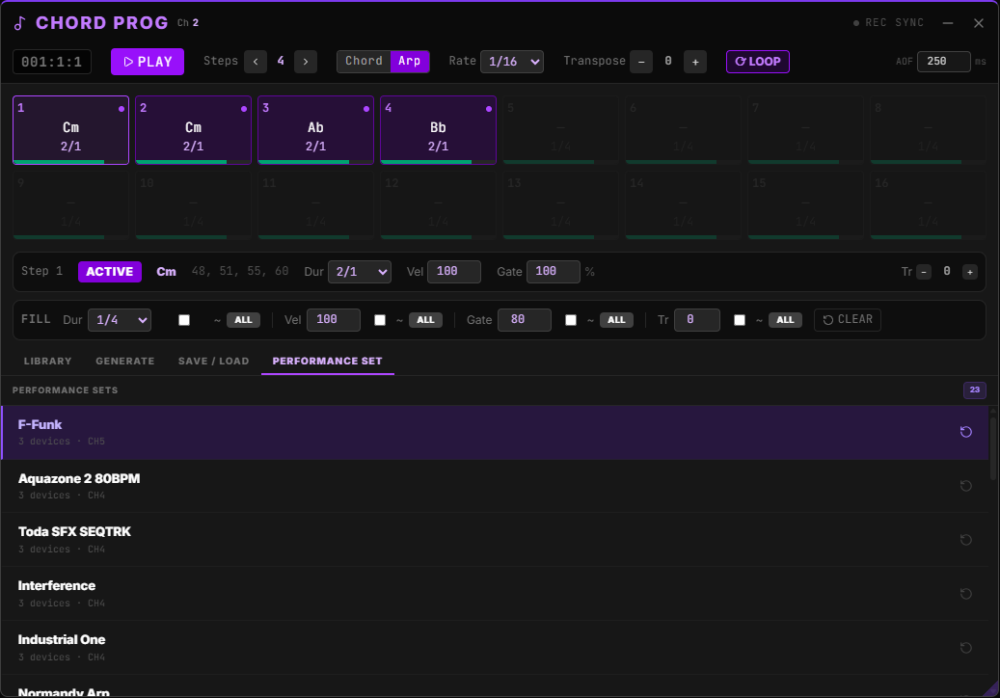

# Chord Progression Sequencer

The **Chord Progression Sequencer** is a dedicated step-based engine for building and performing harmonic sequences in SY.CORE. Each step holds a complete chord — or triggers it as an arpeggio — with individual control over timing, velocity, gate, and transpose. A built-in library of progressions organised by musical key and genre lets you go from zero to a full sequence in seconds.

---

## 1. Overview

- Up to **16 steps**, each carrying a full chord (any number of notes).
- **8 independent progression slots** (A–H), each with its own steps, step count, play mode, and arp rate.
- A **Chain** mode that strings up to 16 slots together into one longer playing sequence.
- Two **play modes**: simultaneous chord voicing or staggered arpeggio — settable globally per slot, or **overridden per step** (Chord/Arp/Auto).
- Per-step **chord strum direction** (Sim / Up / Down / Up-Down / Down-Up) and per-step **arp pattern** (10 styles, shared with the standalone Arpeggiator).
- Per-step control: **duration**, **velocity**, **gate**, and **per-step transpose**.
- Global **sequence transpose** and **loop / once** playback.
- Built-in **progression library** organised by key and genre.
- **Algorithmic generation** from the loaded key source.
- **Save / Load** personal patterns to the cloud (requires account).
- **Draggable, resizable** floating panel — stays on screen during a live set.

---

## 2. Opening the Panel

Click the **Chord Prog** button in the SY.CORE toolbar (or the relevant trigger in your performance layout). The panel opens as a floating window at **z-index 700**, above most other panels.

The panel can be **minimised** (title bar only) without stopping playback, and can be dragged and resized freely on screen. Its position and size are saved to `localStorage` and restored on next open.

---

## 3. Interface at a Glance

---

## 4. Transport Controls

| Control | Description |
|---------|-------------|
| **Bar:Beat:16th display** | Real-time position counter driven by internal tick counter (384th-note resolution). Resets to `001:1:1` on stop. |
| **Play / Stop** | Starts or stops the sequence. Tone.js transport is started on first play. |
| **Steps ◀ / ▶** | Increase or decrease the active step count (1–16). Steps beyond the count are greyed out and skipped. |
| **Chord \| Arp** | Toggles between simultaneous voicing and staggered arpeggio mode. |
| **Rate** | Arp step interval for this slot. Ranges from 128th note to 8 bars, with dotted and triplet variants. Always visible — applies both when the slot is in Arp mode and when individual steps use a per-step Arp override. |
| **Transpose** | Global pitch shift applied to every step (–24 to +24 semitones). Shown in yellow when non-zero. |
| **⟳ Loop / Once** | Loop plays the sequence indefinitely. Once plays through one cycle and stops. |
| **Chain** | Toggles Chain mode. **OFF** plays only the active slot in a loop. **ON** plays through every slot listed in the Chain Editor, in order. |
| **AOF ms** | Delay (milliseconds) before an All Notes Off is sent when stopping. Gives slow-release patches time to decay naturally. Set to `0` for immediate cut. |
| **REC SYNC** | When enabled, starting and stopping the sequencer also starts and stops the Audio Capture recorder. A pulsing red dot signals active recording. |
| **MIDI Ch** | Follows the global channel selector — shown read-only in the header. Change it via the Quick Channel Selector in the footer. |

---

## 5. Slots & Chain

The sequencer holds **8 progression slots**, labelled **A–H**, in a row of buttons in the header. Each slot is a fully independent progression — its own steps, active step count, play mode, and arp rate.

- **Click a slot letter** to switch the editable/displayed slot. The previously active slot is saved automatically before switching.
- The slot ring highlights **purple** for the slot currently being edited/displayed.
- A pulsing **yellow dot** marks whichever slot is actually **sounding** — during Chain playback this can differ from the displayed slot.

### Chain Mode

Enable the **Chain** toggle in the header to play through multiple slots back-to-back instead of looping a single slot:

1. Open the **Chain** tab (bottom tab bar) to build the chain — a grid of 16 chain positions, each with a slot dropdown (`—` = empty, or `A`–`H`).
2. `Clear` empties the whole chain. `✕` on a filled position removes just that slot from the chain.
3. With Chain **ON**, playback advances through the chain in order, looping back to the start if Loop is also enabled.
4. While chain playback is running, the **displayed slot automatically follows whichever slot is currently sounding** — as playback crosses into a new chained slot, the step grid and Step Detail row switch to show it live, so you always see the chords actually playing rather than whatever was last selected by hand.

---

## 6. Step Grid

The grid shows up to 16 cells. Each cell displays:

- **Step number** (top-left).
- **Chord name** (centre) — e.g. `Cmaj`, `F#m7`, `Bdim`.
- **Duration badge** (bottom-centre) — the note length for this step.
- **Velocity bar** (bottom edge) — colour-coded: blue < 40, green 40–80, bright green ≥ 80. No bar when velocity is 0.

### Interacting with Steps

| Action | Result |
|--------|--------|
| **Single click** | Selects the step (opens Step Detail row). If the sequencer is stopped, previews the chord via MIDI. |
| **Double click** | Toggles the step **active / off** without changing its chord data. |
| **Click duration badge** | Cycles the duration forward through all available values. |
| **Shift+click / Right-click duration badge** | Cycles the duration in reverse. |
| **Right-click step** | Opens a context menu to **Copy** or **Paste** the step's full parameter set (chord, notes, velocity, duration, gate, transpose, mode overrides). |

The **currently playing step** is highlighted in yellow. The **selected step** is highlighted in purple.

---

## 7. Step Detail Row

Selecting any step reveals a detail bar beneath the grid:

| Field | Range | Notes |
|-------|-------|-------|
| **Active / Off** | Toggle | Inactive steps are skipped during playback but retain their data. |
| **Chord name** | Read-only | Set by loading from the library, assigning from the chord panel, or using **Custom** (see below). |
| **Duration** | 128n → 8m | Step-specific note length. Overrides nothing globally — each step has its own timing. |
| **Velocity** | 0–127 | Use ↑ / ↓ arrow keys to nudge by 1; Shift+Arrow nudges by 10. |
| **Gate** | 0–100% | Portion of the step duration that the notes sound. `100%` = full legato. |
| **Transpose (Tr)** | –24 to +24 | Per-step pitch offset, stacked on top of the global Sequence Transpose. Yellow when non-zero; reset arrow appears when offset ≠ 0. |
| **Mode** | Auto / Chord / Arp | Per-step override of the slot's global Chord/Arp play mode. **Auto** inherits whatever the slot is currently set to — so one step can play as a strummed chord while the next plays as an arpeggio, without touching the global toggle. |
| **Strum** | Sim / Up / Down / Up-Down / Down-Up | Only shown when this step's effective mode is **Chord**. Controls the order notes are staggered in when the chord isn't played fully simultaneous. |
| **Pattern** | up, down, up-down, down-up, converge, diverge, pinky-up, thumb-up, random, random-other | Only shown when this step's effective mode is **Arp** — the arpeggio style for this step, using the same 10-pattern engine as the standalone Arpeggiator. |
| **Rate** | Slot (default) · any duration value | Only shown when this step's effective mode is **Arp**. Overrides the slot's arp rate for this step only. Shown in yellow when a per-step rate is set. Select **Slot** to remove the override and inherit the slot rate again. |
| **Favorite** | Add current chord to favorites | Collect your favorite chords |

While the sequencer is **playing**, the Step Detail row automatically follows whichever step is currently sounding — it no longer stays frozen on the last step you clicked. Selecting a step manually still works normally when stopped.

### 7.1 Custom Chord Assignment

Click the **Custom** button next to the chord name to open the chord-capture modal. This lets you assign any arbitrary chord to the selected step by playing it — rather than picking from the built-in library.

Two input modes are available:
**CHORD BUILDER**

Shows 18 common chord types (maj, min, 7, maj7, m7, dim, aug, sus2, sus4, dim7, m7b5, etc.) with inversions. Pick a root note, select a chord type, choose an inversion, then preview and assign to the current step. The preview shows the previous step's chord (if any) alongside the new suggestion, and a "Preview A→B→C" button plays prev → current → new in sequence for comparison.

**SUGGEST**

The Suggest tab shows up to 18 common chord types — maj, min, 7, maj7, m7, dim, aug, sus2, sus4, dim7, m7b5, and more — with inversion options. Select a root note, pick a type, choose an inversion (root, 1st, 2nd, 3rd), preview the voicing, and assign it to the current step. Also shows a comparison view of the previous step's chord and the current chord alongside the new suggestion for quick A/B/C evaluation.

**FAVORITE CHORDS**

Collect your favorite chords and assign to any slot later. Click the **Favorite** button on any built chord in the Chord Builder or Suggest tab to save it to your favorites list (stored in IndexedDB). The Favorites tab lists all saved chords with preview and assign buttons.

**MIDI IN**
1. Click **Start Listening** — a pulsing indicator confirms the listener is active.
2. Play and hold a chord on any connected MIDI keyboard. The notes appear as coloured badges in real time.
3. When you release the keys the display keeps showing the last chord you played, so you can review it before assigning.
4. Play a new chord at any time to replace the current capture.

**Virtual Keyboard**
1. Switch to the **Virtual Keyboard** tab.
2. Click notes on the on-screen piano — notes accumulate in the display as you click.
3. The keyboard still sounds normally through your synth while you build the chord.

**Shared controls (both modes)**

| Control | Description |
|---------|-------------|
| **Detected** | Auto-identified chord name (e.g. `Cmaj7`, `F#m`, `Bdim7`). Updated live as notes change. |
| **Chord Name field** | Editable — auto-filled by detection; override by typing any label you like. |
| **Notes** | Row of note labels showing all captured pitches (e.g. `C4 · E4 · G4 · B4`). |
| **Preview** | Plays the captured chord through MIDI for 500 ms so you can hear it. |
| **Clear** | Discards the current capture and resets the display. |
| **Assign to Step N** | Writes the captured notes and name to the selected step. Closes the modal. |

Chord detection covers 18 qualities: major, minor, dim, aug, sus2, sus4, 7, maj7, m7, mMaj7, dim7, ø7, aug7, add9, m(add9), 9, 6, m6. Voicings that don't match a known quality still assign fine — just enter a name manually in the Chord Name field before clicking Assign.

---

## 8. Fill All Row

The Fill row applies a value to **all active steps at once**.

| Parameter | Description |
|-----------|-------------|
| **Dur** | Set a fixed duration, or tick **~** to randomise each step independently. Click **All** to apply. |
| **Vel** | Fixed velocity (0–127), or **~** for random. Click **All** to apply. |
| **Gate** | Fixed gate (0–100%), or **~** for random. Click **All** to apply. |
| **Tr** | Fixed transpose (–24 to +24), or **~** for random (uniform distribution). Click **All** to apply. |
| **Mode** | Auto / Chord / Arp | Sets every step's per-step Mode override at once. **All** applies; **Auto** clears the override so every step follows the slot's global Play Mode again. |
| **Strum** | Sim / Up / Down / Up-Down / Down-Up | Sets every step's chord-strum direction at once. |
| **Pattern** | Any of the 10 arp styles | Sets every step's arp pattern at once. |
| **Rate** | Any duration value | Sets the **slot's arp rate** — the same Rate control that appears in the transport bar, mirrored here for convenience. Useful for quickly trying different arp rates while adjusting other fill settings in one place. |
| **Clear** | Resets all steps to empty defaults (inactive, no chord, default duration). Requires confirmation via the `↺ Clear` button. |

---

## 9. Chain Tab

Builds the play order used when **Chain** mode is enabled (see [§5 Slots & Chain](#5-slots--chain)). Shows all 16 chain positions in a grid — assign a slot letter (A–H) to each position via its dropdown, or leave it `—` to skip that position. The header shows how many positions are filled (`n / 16`), and `Clear` empties the entire chain in one click.

---

## 10. Library Tab

The Library gives access to SY.CORE's built-in chord progression database.

### 10.1 Key / Genre Selector (left column)

Two sub-tabs:

- **Keys** — 13 entries covering standard musical keys (e.g. *C Major*, *G Major*, *A Minor* …). Select a key to load its progressions.
- **Genre** — Style-based categories (e.g. *Jazz*, *Pop*, *Bossa Nova*, *Blues* …). Useful when you want genre-specific harmony rather than a specific tonal centre.

### 10.2 Progressions (centre column)

Lists all named progressions within the selected key/genre. Click a name to load its chords into the chord panel on the right. The first progression is auto-selected when a new key is loaded.

### 10.3 Chords (right column)

Shows every chord in the selected progression.

| Action | Result |
|--------|--------|
| **Click a chord** | Previews the chord over MIDI immediately (1-second sustain). |
| **Chord Transpose** | Shifts the preview (and any subsequent assignment) up/down by semitones without modifying the library data. |
| **+ Step N** | Assigns the selected chord to the currently selected step. |
| **Load All** | Distributes the entire progression across the active step count, replacing existing chord data. Steps are overwritten in order. |

---

## 11. Generate Tab

**GENERATE PROGRESSION**

Generates a random progression automatically from the currently loaded key source.

1. Select your **key or genre** in the Library tab.
2. Switch to **Generate** and click **Generate Progression**.
3. Chords are drawn from a random named progression in the loaded data and spread evenly across all active steps.
4. The **Fill duration** setting in the Fill row is applied to all generated steps. Tick the **~** checkbox in the Fill row before generating if you want random per-step durations.

> The Generate button is disabled while progression data is loading.

**AI GENERATE**

Click the AI Generate button and enter a prompt describing the type of chord progression you want to generate.

> To use the AI generator, you must have an OpenAI API key. Enter your key in the Settings panel

**IMPORT MIDI**

Chord Progression and Piano Roll can now import `.mid` files directly. Chord Progression loads each track as a new slot with per-step chords parsed from simultaneous note-ons. Piano Roll imports every track's notes into the capture grid, preserving pitch, velocity, and timing. Tempo and track names are read from the file.

---

## 12. Save / Load Tab

Requires a SY.CORE account.

### Saving

1. Enter a name in the text field.
2. Toggle **Save All Slots** to persist all 8 slots (A–H), the active slot index, and the chain configuration as a single library entry. When unchecked, only the currently active slot is saved.
3. Press **Save** or hit **Enter**.
4. The current steps (chord data, duration, velocity, gate, per-step transpose) and the active step count are persisted to the cloud under your account.

### Loading

Your saved progressions appear in the right column. Hover a row to reveal:

- **Load** (folder icon) — replaces the current sequence with the saved pattern.
- **Delete** (trash icon) — permanently removes the pattern from the library.

Patterns saved with "Save All Slots" show an **"All Slots"** badge; single-slot saves show **"Single"**. Loading an all-slots pattern restores the full slot set, chain, and active slot.

---

## 13. Performance Set Tab

List of available Performance Sets to select and load the devices patches.

---

## 14. Timeline Markers

The Chord Progression Sequencer exposes three marker types usable in the [Live Timeline](./SYCORE_LIVE_TIMELINE.md):

| Marker Type | Effect |
|-------------|--------|
| `cp-start` | Starts chord progression playback. Supports optional slot (A–H) and chain toggle extras. Dispatches `cp-start` event. |
| `cp-stop` | Stops chord progression playback. Dispatches `cp-stop` event. |
| `cp-select-pattern` | Selects a specific pattern slot (A–H). Dispatches `cp-slot-select` event. |

The timeline processes these markers automatically when the playhead passes their position, so a full arrangement can trigger different chord progression slots at specific bars without manual intervention.

---

## 15. Playback Engine Details

The sequencer uses a **384th-note tick grid** (4× the standard 96 PPQ) to support all standard durations including dotted and triplet values as exact integers.

| Duration | Ticks |
|----------|-------|
| 128th note | 3 |
| 64th note | 6 |
| 16th note | 24 |
| 16th triplet | 16 |
| 8th note | 48 |
| Quarter note | 96 |
| Half note | 192 |
| 1 bar | 384 |
| 2 bars | 768 |

In **Arp mode**, notes within a chord are staggered by the **Rate** interval. The note-off for each arpeggiated note is independent of the overall step gate. Per-step Arp overrides use this same rate but follow their own pattern (see [§7 Step Detail Row](#7-step-detail-row)).

Steps whose effective mode is **Chord** with a strum direction set (not `Sim`) stagger their notes' note-on events by a short offset instead of firing simultaneously, without extending into the step's own duration/gate window.

A delayed **All Notes Off** panic (`AOF ms`) fires after stop to catch any notes that slipped through the timing gap between the sequencer stop and the final scheduled note-off callbacks.

---

## 16. MIDI Sync

| Option | Where to enable |
|--------|----------------|
| **MIDI START/STOP sync** | Enable *Sync MIDI Transport* in the MIDI Manager — sends MIDI Start/Stop messages alongside play/stop. |
| **Audio Capture sync** | Enable **REC SYNC** in the Chord Prog header — recording starts/stops with the sequencer. |

The sequencer output is tagged `MidiSource.CHORD_PROG` internally, which allows the MIDI routing matrix to route it separately from keyboard and Step Sequencer output.

---

## 17. Tips & Best Practices

- **Combine with the Step Sequencer** — run a bass/lead pattern in the Step Sequencer on one MIDI channel while the Chord Prog Sequencer drives pads or strings on another.
- **Use per-step transpose for modulation** — assign the same chord to multiple steps, then use per-step Tr offsets to create a modulating progression without changing the chord.
- **Use slots for song sections** — put verse, chorus, and bridge progressions in separate slots (A, B, C…), then chain them in the Chain tab to play the whole song's harmony in order.
- **Mix Chord and Arp within one progression** — override individual steps' Mode instead of switching the whole slot, e.g. arpeggiate a held pad chord on one step then strum a stab on the next.
- **AOF tuning** — if your synth's release tail is cutting off, raise the AOF delay. If you hear ghost notes, lower it or set it to 0.
- **Loop off for one-shot fills** — switch to *Once* mode for a chord fill that plays exactly one cycle and waits for the next trigger.
- **Chord preview before assigning** — always click a chord in the library panel to hear it before loading it into a step. The preview uses the current MIDI channel and Chord Transpose.
- **Custom chords from ear** — use the Custom modal's MIDI IN mode to capture a voicing you've just improvised: hold the chord, let the name auto-detect, edit it if needed, then assign. Great for capturing extended or altered voicings not in the built-in library.
- **Stack Custom with Library** — mix library chords and custom chords freely within the same progression. Only the selected step is affected by each assign action.
