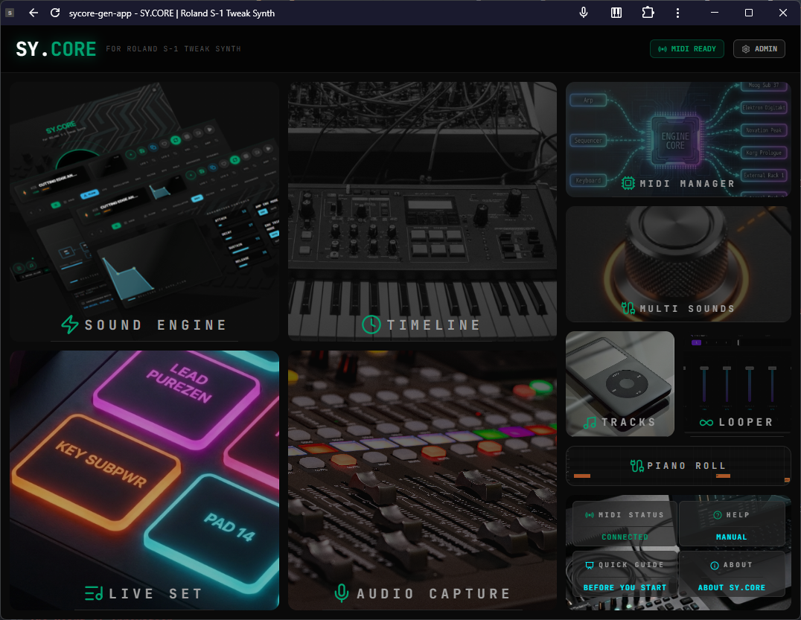

# SY.CORE
## Performance Tools & Sound Design Ecosystem for Electronic Musicians

> *Where algorithmic intelligence meets hardware mastery. Zero latency. Offline-first. Stage-ready.*

   
---

## The Problem Every Electronic Musician Knows

You've invested in premium hardware synths. You've spent hours designing sounds. But on stage — or in the studio — managing MIDI routing, syncing gear, triggering backing tracks, and keeping everything in sync still means juggling fragile DAW setups, driver conflicts, and too many open windows.

**SY.CORE was built to fix this.**

---

## What Is SY.CORE?

SY.CORE is a **local-first, web-native performance and sound design platform** that unifies your hardware, your sounds, and your live workflow in a single, always-reliable environment.

No installation. No drivers. No cloud dependency. Launch from a URL, go fully offline, and perform.

---

## Two Workflows. One Platform.

SY.CORE is purpose-built around the two moments that matter most:

| | **Sound Design** | **Performance** |
|---|---|---|
| **When** | Studio, rehearsal, exploration | On stage, live sets, sessions |
| **Goal** | Generate and sculpt unique sounds beyond hardware limits | Control, trigger, and synchronize everything in real time |
| **Power** | Adaptive Sound Engine + visual feedback | MIDI hub, audio tools, live pads, mixer |

---

# Sound Design 
### Powered by the Adaptive Sound Engine

## The Heart of Innovation

The **Adaptive Sound Engine** is SY.CORE's proprietary synthesis orchestration algorithm — purpose-built for the **Roland S-1** (with more hardware targets on the roadmap).

This isn't a preset browser. It's a **generative intelligence layer** that computes mathematically balanced, stage-ready sounds on demand.

### What It Does

- **Generative Sound Creation** — Instantly synthesize Pads, Leads, Basses, Experimental, etc. (up to 18 different types) sounds with unique flavour variations. Every result is distinct, balanced, and performance-ready.
- **Auto A/B Variations** — Every generated sound ships with an automatic variation for instant comparison.
- **Sound Parameters Visualizer** — Understand your sound at a glance. Graphical visualizers for Flow, LFO, Oscillator, Filter, EFX, and more.
- **Full Data Portability** — Export and import your custom sound banks. Your library travels with you.

### Extend Your Hardware

SY.CORE doesn't just send notes — it **talks to your gear**:

- **Bi-directional Feedback** — Every physical knob turn on the Roland S-1 is instantly reflected in SY.CORE's UI. Every UI adjustment is transmitted to the synth with zero perceptible latency. One hybrid instrument, fully in sync.
- **Extra 2 LFOs** — Add two fully configurable software LFOs and assign them to any hardware parameter. Go beyond your synthesizer's built-in capabilities.
- **Velocity Mapping** — Map velocity to any hardware parameter for expressive, dynamic control.
- **Custom Arpeggiator** — A dedicated arpeggiator engine integrated directly into the sound design flow.
- **MIDI Learn (Contextual)** — Right-click any parameter to enter MIDI Learn mode. Map physical controllers to anything, instantly.

---

# Performance: Professional Orchestration at Your Fingertips

## MIDI — Granular, Stable, Intuitive

SY.CORE's MIDI engine handles setups from a single synth to complex multi-device rigs:

| Capability | Description |
|---|---|
| **Auto-Discovery** | Devices appear automatically on connection |
| **MIDI Routing** | Visual routing matrix for any signal path |
| **MIDI Performance** | Real-time note and CC management |
| **MIDI Mapping** | Assign any CC to any function with Pass Thru / Consume logic |
| **MIDI Actions** | Trigger platform events from incoming MIDI signals |
| **MIDI Sync / Automation** | Keep everything locked to a master clock |
| **MIDI Monitor** | Live MIDI traffic inspector for fast debugging |
| **Config Export/Import** | Save and restore your entire MIDI setup |

### MIDI Capture — Advanced Piano Roll
Capture live input with a full Piano Roll editor. Edit notes, quantize, export as MIDI files, or send directly to the Step Sequencer.

### MIDI Step Sequencer
Build advanced sequences using a generator based on key, octave, note ranges, and scale. Attach up to **2 parameters per step**, randomize values, and associate sequences directly to sounds. Up to 2 sequences per sound.

### Device Program Change Manager
Manage presets across hardware devices via Program Change messages. Supported auto-populated preset libraries:
- **Arturia MicroFreak** (firmware 5.0): import .mfprojz presets automatically converted to Presets list (filter by category available)
- **Yamaha SEQTRACK** (Multitimbral with MIDI Channel selector)

### Performance Sets
Bundle device presets into Performance Sets (Soundsets) and load your entire multi-device configuration in a single click.

---

# Performance Tools

## Live Timeline

A visual arrangement timeline for live performance. 
It sequences backing track segments, fires MIDI/UI events at specific time positions (markers), and controls MIDI transport sync independently of the
Backing Track Player's own sync logic.

## Live Performance 
A virtual surface controller completely mappable to external controllers with a practical MIDI Learn function.

| Control | Description |
|---|---|
| **16 Soundset Pads** | One-touch loading of complete device preset configurations |
| **16 Track Pads** | Instant playlist track selection during live performance |
| **Volume Mixer** | Per-device MIDI CC mixer for real-time level control (device-dependent) |

## Looper *(Experimental)*
An 8-track looper with autosync and autolimiting — built for the stage.

---

# Audio Tools

### Backing Tracks Player
- Build and manage a library of mp3, ogg, and wav backing tracks
- Full playlist engine: **autoplay, loop, crossfade, tempo sync, clock sync**

### Audio Capture
- Capture from any supported audio interface
- Normalize with Gain/Gate controls
- Crop audio with precise start/end markers
- Loop playback with optional clock sync
- Send captured clips directly to the Audio Looper / Backing Tracks Playlist
- Import/Export in mp3 and wav formats

# Platform Architecture

## Why Web-Native?

SY.CORE runs on the latest evolution of browser-based music technology — **Web MIDI API** and **Web Audio API** — delivering a lightweight, driver-free alternative to traditional desktop software.

- **Zero Installation** — Launch via URL. No setup, no installers, no onboarding friction.
- **Always Current** — Updates deploy server-side. You're always on the latest version automatically.
- **Driverless Hardware Communication** — Direct integration with Windows MIDI Services and CoreMIDI. No driver conflicts, ever.
- **Universal via PWA** — Full-screen, system-integrated experience on Windows, macOS, Linux, and Android.

## Local-First Reliability

Stage environments are unpredictable. SY.CORE's **Local-First Architecture** (IndexedDB + Service Workers) means your performance never depends on a network connection.

- **Works Fully Offline** — Once saved to your device, the PWA launches and operates with zero internet.
- **Instant Boot** — No cloud round-trips. Your sounds, presets, and tracks are ready as fast as your hardware.
- **Persistent State** — All customizations, sessions, and data live on your device, not a server.

---

# Technology Stack

| Technology | Role | Advantage |
|:---|:---|:---|
| **Web MIDI API** | Hardware device communication | Direct routing, near-zero latency |
| **Web Audio API** | Synthesis and audio processing | Modular, high-performance node graph |
| **Service Workers (PWA)** | Asset and resource management | Full offline functionality, instant reload |
| **IndexedDB** | Local data persistence | Professional-grade state management |

---

# Who SY.CORE Is For

**Live Electronic Artists**
Musicians who need a rock-solid, integrated alternative to fragile DAW setups on stage.

**Sound Designers**
Professionals seeking algorithmic, generative approaches to hardware sound creation.

**Hardware Enthusiasts**
Anyone ready to unlock the full potential of their MIDI synthesizers through intelligent software that speaks hardware natively.

---

## Feature Summary

| Feature | Capability |
|:---|:---|
| Adaptive Sound Engine | Generative synthesis for Roland S-1 with auto A/B variations |
| MIDI Hub | Centralized routing (Grid/Flow views), USB-MIDI, Virtual Ports |
| Smart Latch | Generative note-holding with FIFO policy and Replace Mode |
| BPM Master Clock | Rock-solid synchronization for all time-based effects |
| MIDI Learn | Right-click contextual mapping with Pass Thru / Consume logic |
| Audio Looper | 8-track looper with autosync (experimental) |
| Backing Tracks | Playlist engine with crossfade and clock sync |
| Step Sequencer | Scale-aware sequence generator with per-step parameter automation |
| Soundsets | One-click full multi-device preset configuration |
| PWA | Offline-first, cross-platform, zero installation |

---

## About SY.CORE Lab

SY.CORE Lab is a research and development collective operating at the intersection of **Music Technology, Adaptive Algorithms, and Human-Instrument Interaction**.

Our mission: build tools that feel like instruments, not software.

---

*SY.CORE — Made with Precision & Neural Magic.*

*© SY.CORE Lab. All rights reserved.*
