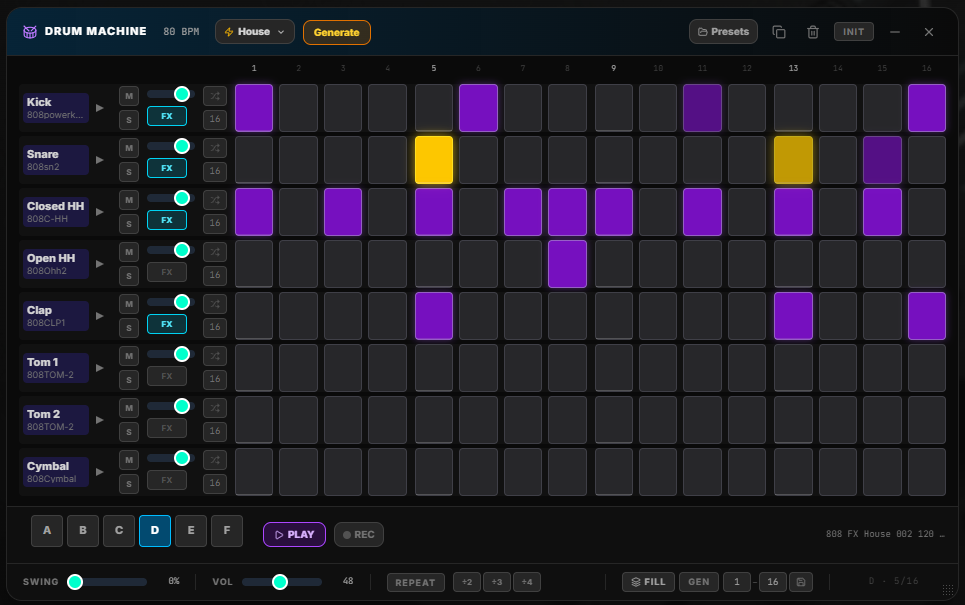
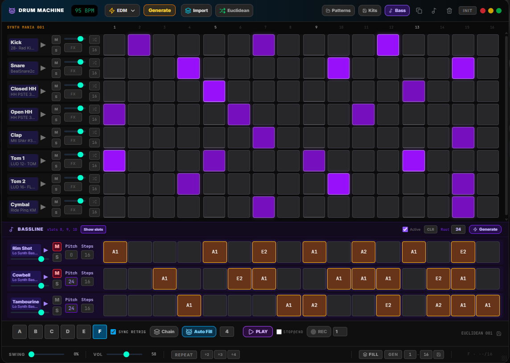
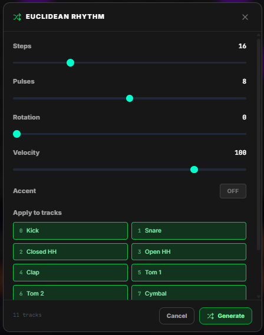

# Drum Machine

The **Drum Machine** is 

- **11-tracks · 16-steps pattern sequencer** built for live performance. Each track holds a loaded sample and an independent step sequence with per-step velocity, accent, and ratchet. 
- **Track FX**: Pan, Pitch, Tone, Reverb, Delay (Copy/Paste FX to patterns)
- **8 pattern banks** (A–H) let you switch between arrangements on the fly, 
- **Chain Mode**: chain up to 8 patterns with autofill support
- **Fill & Autofill**: system overlays a 1-4 bars variation without interrupting the main loop, can be automated every N bars
- **Generate**: engine produces style-aware patterns in one click (11 styles)
- **Euclidean**: Bjorklund-algorithm rhythm generator with per-track randomization (Steps/Pulses/Rotation)
- **Bassline**: 3-voice monophonic sequencer assigned to the last 3 drum slots with per-step MIDI note control
- **Import**: from different styles/patterns (about 250)
- **Presets**: save your pattern banks for immediate recall (unlimited)
- **DrumKits**: create your custom drum kits, save and recall when you need (unlimited)
- **MIDI Learn** available on almost all controls

---

## Opening the Panel

| Method | Action |
|--------|--------|
| **Home page** | Click the **Drum Machine** tile |
| **Toolbar / Main Menu** | Add "Drum Machine" via Toolbar Settings |

The panel opens as a floating, **draggable and resizable** window (initial 960 × 520 px, minimum 720 × 380 px). Drag any free area of the header to reposition; drag any edge or corner to resize. Position and size persist thru sessions.

---

## Interface Layout

| Area | Content |
|------|---------|
| **Header** | Title · BPM · Style picker · Generate · Import · **Euclidean · Regen** · Presets · Kits · **Bass** · Init · minimize/close |
| **Step ruler** | Step numbers 1–16 grouped in four beats of four |
| **Track grid** | 11 track rows — label, load, preview, mute, solo, volume, FX toggle, randomize velocity, step count, 16 step buttons |
| **FX strip** | Per-track expandable row — Pan, Pitch, Tone, Reverb, Delay, Copy/Paste FX |
| **Transport bar** | Sequence tabs A–F · Play/Stop (with Stop@end + Fill) · REC SYNC (with bar multiplier) · Sync Retrig toggle · Chain toggle · Autofill toggle · active preset name |
| **Footer** | Swing · Master Volume · Repeater (÷2/÷3/÷4) · Fill (trigger / Gen / step range / Save) · sequence position display |

---

## Sequences A–F

Eight independent pattern banks share the same 8 tracks but hold separate step data and sound assignments.

| Action | Result |
|--------|--------|
| Click a tab (A–H) while **stopped** | Switches immediately |
| Click a tab (A–H) while **playing** | Switch is **quantized** — applied at the next bar boundary (step 1). The tab pulses until the switch fires |
| **Copy pattern** (header) | Copies the active sequence into a chosen target bank |
| **Clear pattern** (header) | Erases all steps in the active sequence |

### Sound inheritance

If a slot in sequence B (or C, D, E, F, G, H) has no sample loaded, it falls back to the nearest earlier sequence that does. The sample label displays in **purple** when it belongs to the current sequence, or **grey** when inherited from a previous one.

---

## Track Controls

Each row exposes the following controls from left to right:

| Control | Description |
|---------|-------------|
| **Label / load button** | Click the folder icon to pick a local audio file. Drag a URL onto the label to load from a link. Hover for the full sample name. Right-click to load from the **Sound Folder Browser** |
| **Preview (▶)** | Plays the sample once at full volume for quick auditioning |
| **M** | Mute this track. Red when active |
| **S** | Solo this track. Amber when active. Multiple solos stack |
| **Volume slider** | Per-track gain (0–1). Right-click to MIDI-learn |
| **FX** | Toggle the FX strip for this track. Cyan-outlined when the track has non-default FX |
| **Shuffle icon** | Randomizes velocity of all active steps in this row (70–127 range) |
| **Step count** | Sets the track's active step length (1–16). Click to increment, right-click to decrement, scroll to adjust. Tracks can have different lengths for polyrhythmic patterns. Highlighted purple when shorter than 16 |

---

## FX Strip

Clicking the **FX** button on any track expands a horizontal FX strip below that row. Changes apply in real time.

| Parameter | Range | Description |
|-----------|-------|-------------|
| **Pan** | −1 (L) → +1 (R) | Stereo placement |
| **Pitch** | −12 → +12 semitones | Pitch shift in whole semitones |
| **Tone** | 200 Hz → 20 kHz | Low-pass filter cut-off frequency |
| **Rev** | 0 → 100 | Reverb send amount |
| **Dly** | 0 → 100 | Delay send amount (1/8-note, BPM-synced) |

### FX Copy / Paste

- **COPY FX** — copies the current track's five FX values to a clipboard.
- After copying, eight sequence buttons (A–H) appear. Click any to paste those values into the same track slot in that sequence. Click **ALL** to paste to every sequence at once.
- A **FX COPIED** toast confirms the copy. The active sequence is highlighted cyan; other sequences are dim.

FX settings are stored per track per sequence and are included in presets.

---

## Step Grid

### Step ruler

A numbered ruler above the grid shows steps **1–16** grouped into four beats of four (matching the visual gap between columns). The current playhead step turns **white** while playing.

### Step button states

| State | Appearance |
|-------|------------|
| **Inactive** | Dark grey |
| **Active** | Purple glow |
| **Active + accent** | Yellow glow |
| **Active + ratchet** | Purple with a small number badge (2/3/4) in the top-right corner |
| **Current step** | White ring overlay |
| **Beyond track length** | Dimmed, not clickable |

A faint white line marks the first step of each beat group (steps 1, 5, 9, 13).

### Velocity transparency

Active steps reflect their velocity visually:

| Velocity | Opacity |
|----------|---------|
| 1–30 | 30% |
| 31–50 | 50% |
| 51–100 | 75% |
| 101–127 | Full |

### Right-click step context menu

Right-clicking any active drum step opens a popover with:

- **Velocity** — drag slider (0–127)
- **Accent** — toggle yellow boost
- **Ratchet** — 1 / 2 / 3 / 4 hits per step slot

Right-clicking any active bassline step opens a similar popover that also includes **Note** (MIDI pitch 24–60).

## Polymetry — Per-Track Step Count

Each track wraps independently at its configured step count. A track set to 12 steps cycles through steps 1–12 while other tracks complete their full 16. The global 16-step clock still governs the bar boundary (used for quantized sequence switching, Fill auto-stop, and REC SYNC).

---

## Transport Bar

Located between the track grid and the footer, the transport bar holds the main playback controls:

| Control | Description |
|---------|-------------|
| **Sequence tabs A–H** | Switch patterns. Respects **Sync Retrig** (checkbox in transport bar): ON = quantized to bar boundary while playing; OFF = immediate switch. MIDI-learnable |
| **▶ / ■** | Start / Stop the sequencer. BPM syncs from the global arpeggiator BPM on open. **Stop@end** checkbox arms a pending stop at the next bar boundary; **+Fill** plays a fill on the final bar |
| **BPM display** | Read-only; reflects the current global tempo |
| **Chain** | Toggle button to enable pattern chain playback. When active, a chain editor row appears below the transport bar with 8 slots. Click a slot to cycle through A–F (or null). The sequencer advances through the filled slots sequentially, wrapping at the end |
| **Autofill** | Automatically triggers a fill every N bars. Toggle on/off and set the interval (1–128 bars) via the input field next to the toggle |
| **Sync Retrig** | Checkbox. When ON (default), sequence tab clicks while playing are quantized to the next bar. When OFF, they switch immediately |
| **REC SYNC** | Arms a synchronized Audio Capture recording (see below). The **bar multiplier** input (default 1) controls how many 16-step bars to record |
| **Preset name** | Displays the currently loaded preset name (right side, truncated) |

---

## Master Volume

A **Vol** slider in the footer controls the overall output gain of all 11 tracks simultaneously (0–100). This is separate from per-track volume and is not stored in presets. Right-click to MIDI-learn.

---

## Generate

Select a style from the dropdown next to the header, then click **Generate**. The pattern replaces the active sequence's steps with a style-aware pattern. The **→Fill** toggle (small button next to Generate) redirects the output to the fill pattern instead.

### Styles

`House` · `Techno` · `HipHop` · `Trap` · `Funk` · `Jungle/DnB` · `Latin` · `Rock` · `EDM` · `Pop` · `Jazz`

Each style has multiple variants; one is chosen randomly on each press so repeated generates produce unique results within the genre feel. After the base variant is applied, **style-aware variation** adds musical unpredictability — ghost notes on empty steps, accent promotion/demotion, ratchet subdivision, and velocity jitter — all tuned per style (e.g., Jazz gets high ghost-note density and wide velocity jitter; EDM stays tight with minimal variation).

---

## Bassline

The bassline section lets you control 3 melodic voices assigned to the last three drum slots (Rim Shot, Cowbell, Tambourine by default). Each voice is a 16-step monophonic sequencer with per-step pitch (MIDI note).

### Enabling Bassline

Click the **Bass** button in the header to toggle the bassline panel. When active:
- The bassline panel slides open below the track grid
- Drum slots 8–10 (Rim Shot, Cowbell, Tambourine) are **automatically hidden** from the track grid
- Bassline voices use those slots as their audio output

### Voice Controls

| Control | Description |
|---------|-------------|
| **Slot label** | Shows the assigned drum track name and loaded sample name. Click to open the **Sound Folder Browser** and assign a different sample. Click the ▶ button to preview |
| **M** | Mute this bassline voice. Also mutes the corresponding drum track slot |
| **S** | Solo this bassline voice. Also solos the corresponding drum track slot |
| **Pitch** | Semitone offset (0–24) applied to all notes of this voice |
| **Tone** | Low-pass filter cutoff (200 Hz – 20 kHz) per voice |
| **Vol** | Per-voice volume (0–1) |
| **Steps** | Active step length (1–16). Click to cycle |

### Bassline Header

| Control | Description |
|---------|-------------|
| **Hide slots / Show slots** | Manually toggle visibility of drum slots 8–10. Auto-hides when bassline opens |
| **Active** | Toggle bassline playback on/off without closing the panel |
| **CLR** | Clear all steps and notes from all bassline voices |
| **Root** | MIDI root note (12=C1, 24=C2, 36=C3, 48=C4, 60=C5). Used by the Generate button |
| **Generate** | Generates a 3-voice bassline pattern based on the root note — voice 1 plays root/fifth/octave, voice 2 plays offbeat syncopation, voice 3 adds ghost-note variation |

### Step Grid

Each voice has 16 step buttons. Click to toggle a step on/off. Right-click for velocity, accent, and ratchet settings. When a step is activated for the first time, it receives a default MIDI note (C3 = 36).

**MIDI Note Capture:** Click a step button to arm it for MIDI note capture (it turns orange). Play a note on your connected MIDI controller — the captured note is assigned to that step and the step activates.

**Scroll to adjust:** Hover over a step and scroll to cycle its pitch up/down.

---

## Euclidean Generator

The Euclidean generator creates rhythms using the Bjorklund algorithm, which distributes `pulses` evenly across `steps` positions — similar to the Euclidean rhythm found in many hardware sequencers (e.g., Elektron, Korg volca).

### Opening the Dialog

Click the **Euclidean** button in the header. A dialog opens with the following controls:

| Control | Range | Description |
|---------|-------|-------------|
| **Steps** | 1–64 | Total number of steps in the generated pattern |
| **Pulses** | 0–steps | Number of active hits distributed evenly across steps |
| **Rotation** | 0–(steps-1) | Shift the pattern forward by N positions |
| **Velocity** | 1–127 | Velocity applied to active steps |
| **Accent** | ON/OFF | Apply accent flag to active steps |
| **Apply to tracks** | 11 checkboxes | Select which tracks receive the generated pattern |

Click **Generate** to apply. Each selected track receives its own unique Euclidean pattern with randomized pulse density and rotation, creating varied interlocking rhythms rather than identical patterns across all instruments.

### Regen

After the first Euclidean generation, a **Regen** button appears next to the Euclidean button. Click it to re-run the Euclidean generator with the **same settings** (steps, pulses, rotation, velocity, accent, track selection) without reopening the dialog — each click produces a fresh randomized variation.

### Icons

- **Euclidean** — opens the generator dialog
- **Regen** (green, visible after first use) — quick re-generate with same settings

---

## Fill

A one-bar overlay pattern that temporarily replaces (or augments) the main sequence for exactly one bar, then auto-stops.

| Control | Description |
|---------|-------------|
| **Fill button** | Triggers the fill for one bar. Pulses cyan while active. MIDI-learnable |
| **Gen** | Generates a new random fill pattern using one of 6 musical archetypes (snare roll, tom cascade, kick frenzy, HH frenzy, broken/syncopated, crash & build) |
| **Step range inputs** | Two number fields (default 1–16). Defines which steps are written when saving |
| **Save icon** | Writes the fill steps within the configured range into the current active sequence |

> Use the step range to blend fill elements into your pattern — set `13–16` to replace only the last beat, leaving the rest of the sequence unchanged.

---

## REC SYNC

Arms a synchronized [Audio Capture](./SYCORE_AUDIO_CAPTURE.md) recording that starts exactly on the next bar boundary and records for precisely 16 steps (multiplied by the **bar multiplier** setting), then stops automatically.

| Control | Description |
|---------|-------------|
| **Bar multiplier** | Small number field (default 1, range 1–8). Records N × 16 steps before auto-stopping |
| **Toggle button** | Click once to arm. Click again to cancel |

| State | Indicator |
|-------|-----------|
| **Idle** | Grey dot · "REC SYNC" label |
| **Armed** | Pulsing orange · "ARMED" |
| **Recording** | Pulsing red · "REC" |

Recording fires and stops at actual audio playback time (not transport lookahead), ensuring sample-accurate capture. AudioCapture is pre-warmed when REC SYNC is armed so the monitor is ready the moment recording starts.

---

## Stop@end

Located next to the Play/Stop button, two checkboxes control end-of-bar stop behavior:

| Control | Description |
|---------|-------------|
| **Stop@end** | When checked, pressing stop arms a pending stop that fires at the next bar boundary. The button label changes to "ENDING…" while armed. Click again to cancel |
| **+Fill** | Only visible when Stop@end is active. When checked, a fill pattern is generated and triggered on the final bar before stopping |

---

## Chain Mode

Chain mode lets you sequence up to 8 pattern slots in order for continuous playback.

Enable chain mode by clicking the **Chain** toggle in the transport bar. When active, a chain editor row appears below the transport bar showing 8 clickable slots.

| Action | Result |
|--------|--------|
| **Click a slot** | Cycles through `null → A → B → C → D → E → F → G → H → null` |
| **Right-click a slot** | Clears the slot to null |
| **Clear all button** | Empties all 8 slots |

While chain mode is active and the sequencer is playing, each slot is played for one bar before advancing to the next filled slot. Empty slots are skipped. A blue highlight on the slot indicates the currently playing position.

Chain configuration (slots and autofill settings) is saved and restored with presets.

---

## Autofill

When enabled, automatically triggers a generated fill at a regular interval.

| Control | Description |
|---------|-------------|
| **Autofill toggle** | Enables/disables automatic fill generation |
| **Interval input** | Number of bars between fills (1–128, default 4). A fill is triggered every N bars while the sequencer plays |

Autofill works independently of manual fill triggering — both can operate simultaneously.

---

## Repeater

When **Repeat** is active (orange), every playing step is retriggered at a sub-step division:

| Division | Effect |
|----------|--------|
| **÷2** | Two hits per step |
| **÷3** | Three hits per step |
| **÷4** | Four hits per step |

Velocity tapers per retrigger (each hit is slightly softer) for a natural machine-gun feel. Repeater overrides the per-step ratchet setting while active.

---

## Presets

Click the **Presets** button in the header to open the preset drawer.

| Action | How |
|--------|-----|
| **Save new** | Type a name and press Enter or click Save |
| **Load** | Click a preset row |
| **Overwrite** | Hover a preset row → click the amber save icon. A **PRESET SAVED** toast confirms the write |
| **Delete** | Hover a preset row → click the red trash icon |

Presets store all eight sequences (A–H) including step data, per-track sound assignments, per-track FX settings, and the active sequence at save time.

---

## Init

The **Init** button in the header clears all eight sequences and all sound assignments, resetting the Drum Machine to a blank state. An inline confirmation ("Clear all? Yes / No") must be acknowledged before the data is erased.

---

## MIDI Learn Reference

Right-click any labelled control to open the MIDI Learn context menu. An orange dot pulses on the target while learning.

| Parameter | Control | Type |
|-----------|---------|------|
| `dm_play_stop` | Play / Stop | Trigger or toggle CC |
| `dm_seq_a` … `dm_seq_h` | Switch to sequence A–H | Trigger |
| `dm_fill` | Trigger Fill | Trigger |
| `dm_generate` | Generate pattern | Trigger |
| `dm_repeat` | Toggle Repeater | Trigger or toggle CC |
| `dm_vol_0` … `dm_vol_10` | Track volume 1–11 | Continuous CC (0–127) |
| `dm_pad_0` … `dm_pad_10` | Trigger pad 1–11 (preview / play sample) | Trigger |
| `dm_master_vol` | Master (footer) volume | Continuous CC (0–127) |
| `dm_level_master` | AudioMixer drum level | Continuous CC (0–127) |

Triggers respond to Note On or any CC value > 0. Sequence switches are quantized to the bar when playing, exactly as when clicking the tabs.

---

## Persistence

| Data | Storage | Survives reload |
|------|---------|-----------------|
| All 8 sequences (steps, velocity, accent, ratchet, lengths) | `localStorage` | ✔ |
| Sound assignments per sequence per track | `localStorage` (blob keys in IndexedDB) | ✔ |
| FX settings (pan, pitch, tone, reverb, delay) per track per sequence | `localStorage` | ✔ |
| BPM, Swing, Repeater settings | `localStorage` | ✔ |
| Presets | `localStorage` | ✔ |
| Panel position / size / minimized | `localStorage` | ✔ |

---

## Related Guides

- [Audio Capture](./SYCORE_AUDIO_CAPTURE.md) — recorder driven by REC SYNC
- [Samples Machine](./SYCORE_LOOP_MACHINE.md) — pad-based loop playback with DrumMachine automation controls
- [Step Sequencer](./SYCORE_STEP_SEQUENCER.md) — melodic MIDI sequencing engine
- [MIDI Mapping](./SYCORE_MIDI_MAPPING.md) — managing learned CC mappings
- [Freesound Browser](./SYCORE_FREESOUND_BROWSER.md) — loading samples from freesound.org
