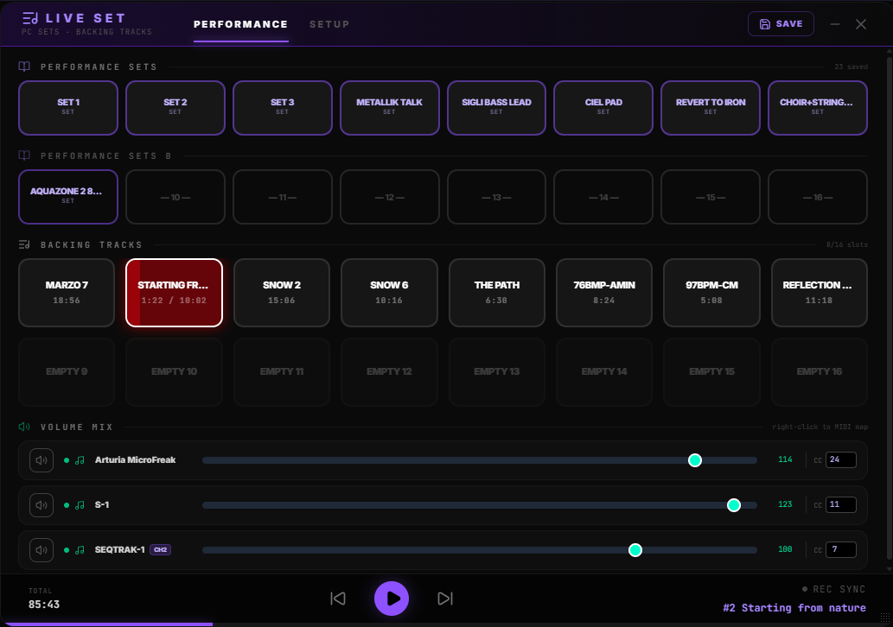
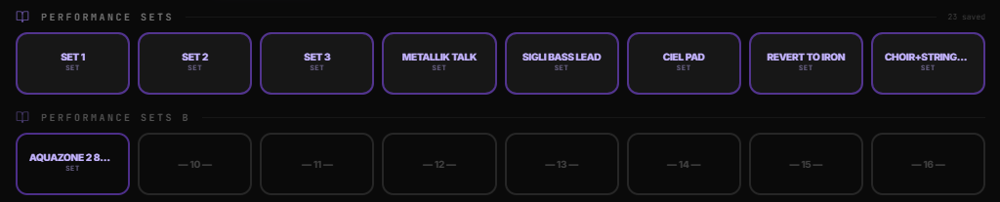
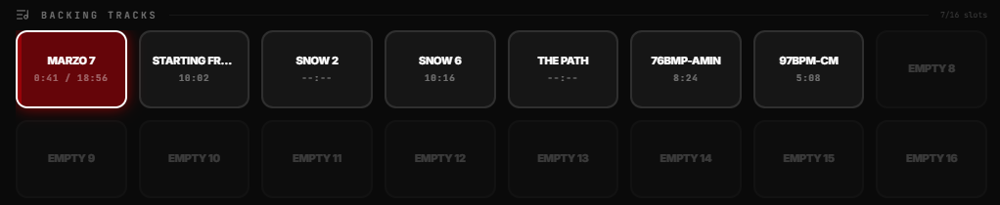
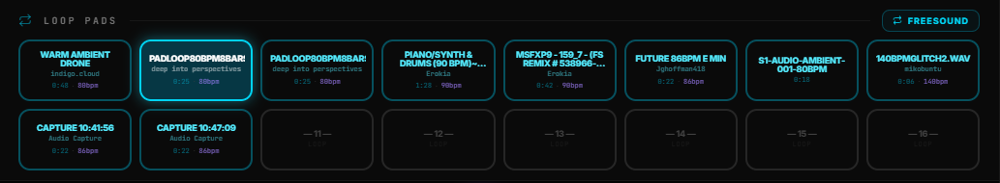

# LIVE SET

**Live Set** is the dedicated **show-mode** control center. It consolidates three essential live tools into a single panel:

1. **Performance Sets** — 16 one-touch recall pads for complete device program change states
2. **Backing Tracks** — a 16-slot playlist pad grid for click-and-play audio tracks
3. **Loop Pads** — 16 one-touch recall pads for click-and-loop audio, can be mapped to freesound.org sounds

All three can run simultaneously. MIDI mappings allow any pad, track, or fader to be triggered from a hardware controller. Pad layouts can be saved and recalled as **Snapshots**.

---

## Interface Layout

---

## Tabs

### Performance Tab (default)

The show mode view. All pads, backing tracks, volume mix, and the player footer are visible here.

### Setup Tab

Three sub-tabs for configuration:

| Sub-tab | Purpose |
|---------|---------|
| **Performance Sets** | Assign saved PC sets to each of the 16 pads |
| **Playlist** | Full playlist editor (reuses `PlayList` component) |
| **Snapshots** | Save/load/delete complete pad layout snapshots |

---

## Performance Sets

### What is a Performance Set?

A Performance Set is a saved state created in the **Device Program Change Panel**. It stores:
- The SY.CORE MIDI channel
- For each device: program change channel, bank, program, and multi-channel assignments
- For the "UI device" (Roland S-1): the last recalled preset ID

### 16 Pads (Rows A and B)

- **Row A (1–8):** Primary sets, highest stage.
- **Row B (9–16):** Secondary sets, labeled "Performance Sets B".

Each pad shows the set name. Empty pads display `— N —`.

**Active pad:** Highlighted in solid violet with a glow and a pulsing white overlay animation.

### Triggering a Pad

1. Click the pad (or send a mapped MIDI CC/note).
2. All devices receive `All Notes Off` (CC 123 = 0) on every channel.
3. The PC set is applied: bank select + program change sent per device channel configuration.
4. For the "UI device", the preset from history is recalled silently.

### MIDI Learn

Right-click any pad to open the MIDI learn context menu. Param name: `lpp_set_N` (where N = 0-based index).

---

## Backing Tracks

The backing track section uses the `PlaylistPadGrid` component — 16 clickable track pads driven by `livePadStore.playlist`.

- Click a pad to start that track immediately (dispatches `playlist-play` with crossfade).
- MIDI learn prefix: `lpp_bt_N` (0-based).
- The playlist state is shared with `LiveSet` via `livePadStore` and the `BackingTrackPlayer` event bus.

### Player Footer

A persistent transport bar at the bottom of the Performance tab:

| Control | Action |
|---------|--------|
| **◀** | Previous track |
| **▶ / ⏸** | Play / Pause (right-click for MIDI learn → `lpp_playstop`) |
| **▶▶** | Next track |
| **REC SYNC** | Toggle — see below |

**Total progress bar** runs the full width below the footer, showing `totalCurrentTime / totalPlaylistDuration`.

### REC SYNC

The **REC SYNC** indicator in the player footer has two independent sources:

| Source | Behaviour |
|--------|-----------|
| **MidiSyncMatrix** (Backing Track → Capture or Loop Pads → Capture) | Persistent global setting — survives page reload, shared with all consumers |
| **Local REC SYNC toggle** (in the Live Performance Pad footer) | Session-only — never writes to the sync store, does not affect MidiSyncMatrix settings |

The indicator lights up when **any** of the three is active. Clicking it toggles only the local session flag; it never overrides the Matrix settings.

When the local toggle is on and a backing track starts or stops, `capture-start-rec` / `capture-stop-rec` events are dispatched to Audio Capture. The footer background pulses red while both local sync and playback are active.

---

## Loop Pads

A 16-pad grid (two rows of 8) for triggering looped audio samples. Pads are independent of Performance Sets and can run simultaneously with a backing track.

### Assigning a sound

| Method | How |
|--------|-----|
| **Freesound Browser** | Click **Pad** on any search result, pick a slot in the pad picker |
| **Local file** | Click the folder icon on an empty pad — loads MP3/WAV/OGG directly |
| **Audio Capture** | Click **→ Loop Pad** in Audio Capture, pick a slot in the modal |

Assignments are saved to localStorage (`SYCORE_LPP_LOOP_PADS`) and restored on reload. Sounds from Freesound or Audio Capture are also cached in IndexedDB so they play without re-downloading.

### Playing and stopping

- Click an assigned pad to start the loop. The pad glows cyan with a pulsing overlay.
- Click again to stop. Only one pad plays at a time — starting a new pad fades out the current one (unless crossfade is disabled).
- The **crossfade toggle** (⚡/≋ button, top-left of pad on hover) switches between smooth crossfade and instant cut.
- The **clear button** (✕, top-right on hover) removes the assignment.

### BPM sync

If the sound has a BPM tag (from Freesound acoustic analysis or manual entry), starting the pad automatically sets the global BPM (`arpStore.arpBpm`, `midiStore.currentBpm`, and the MIDI clock).

### MIDI Learn

Right-click any Loop Pad to open the MIDI learn context menu. Param name: `lpp_loop_N` (0-based). The assigned controller LED turns **green** when the pad is playing and **amber** when stopped — identical to Performance Set pad feedback.

Right-click is also available on each slot inside the **Freesound Browser pad picker**, so you can assign MIDI triggers without opening the Live Performance Pad directly.

---

## Snapshots

A snapshot saves the complete assignment of all 16 pads (which PC set is assigned to each pad). This does not save the PC set contents — only the pad → set ID mapping.

| Action | Result |
|--------|--------|
| **Save** | Opens a name dialog; creates a new snapshot |
| **Save** (when active snapshot exists) | Updates the currently active snapshot in-place |
| **Save New** | Always creates a new snapshot |
| **Load** | Restores pad assignments from the snapshot |
| **Delete** | Removes snapshot from storage |

The active snapshot is highlighted in the list and its name appears in the header. Snapshots are persisted in `SYCORE_LPP_SNAPSHOTS` (localStorage).

**Old 8-pad snapshots** are automatically migrated to 16 pads (padded with empty entries) on load.

---

## MIDI Listener

A dedicated raw MIDI listener runs independently of the main CC listener. It monitors all inputs and resolves mapped param names:

| Param pattern | Trigger |
|--------------|---------|
| `lpp_set_N` | Triggers Performance Set pad N (fires on note-on or CC > 0) |
| `lpp_loop_N` | Toggles Loop Pad N (play/stop) |
| `lpp_bt_N` | Plays backing track N |
| `lpp_mix_DeviceName` | Sets device volume to the CC value |
| `lpp_playstop` | Toggles playlist play/stop |

LED feedback is sent for all `lpp_set_N` and `lpp_loop_N` mappings: **green** = active/playing, **amber** = inactive/stopped. The active state for loop pads is tracked in `livePadStore.loopActivePads` and watched by the controller manager.

---

## Tips

- **Set order matters:** Pad 1 should be your opener set — it's the first pad a controller will hit if mapped sequentially.
- **REC SYNC workflow:** Enable REC SYNC before the set. Hit Play — the backing track starts, and a connected Audio Capture will know to start recording simultaneously.
- **Snapshot discipline:** Save a snapshot before every show with the set name (e.g. `Show 2026-06-01`). Use **Save New** at the top of each show, not **Update**, so you keep historical show configs.
- **Loop Pad BPM tagging:** When assigning a Freesound sound to a pad, enter the BPM in the picker. Starting that pad will sync the global clock to its tempo automatically.
- **Loop Pad MIDI grid:** Map `lpp_loop_0` through `lpp_loop_15` to a grid of 16 pads on your controller. Green = playing, amber = stopped — your controller mirrors the pad state live.
- **REC SYNC isolation:** The REC SYNC toggle in the player footer is session-only — it won't break your MidiSyncMatrix configuration. Use the Matrix for persistent show-night sync; use the footer toggle for quick ad-hoc recording during rehearsal.

---

*Last updated: 2026-06-08*
