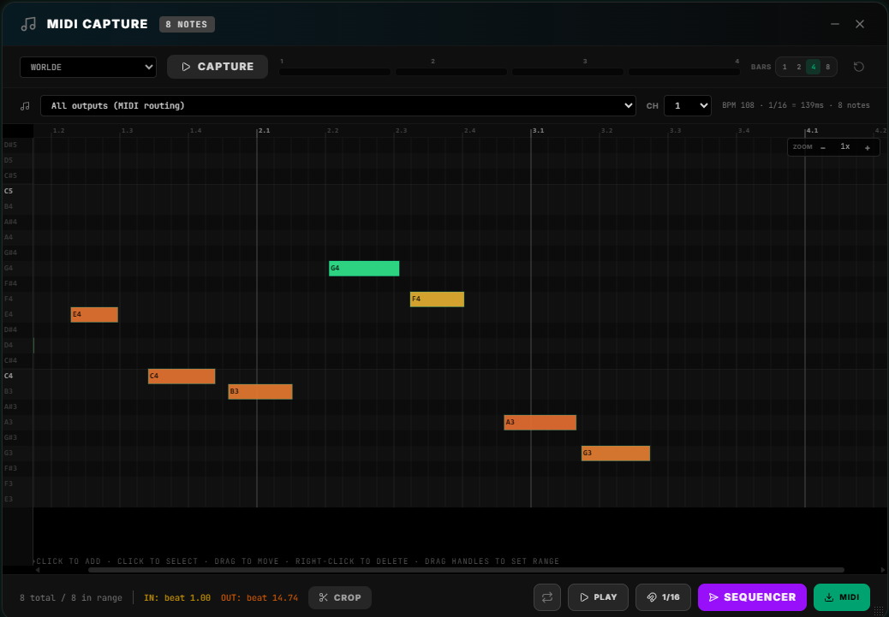
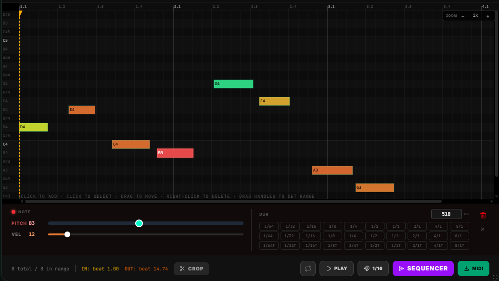

# MIDI Capture

**MIDI Capture** records live MIDI note performance into an interactive piano roll. After stopping, the captured notes can be reviewed, edited (pitch, velocity, duration), cropped to a precise range, quantized, played back through any MIDI output, and exported as a `.mid` file or sent directly into the Step Sequencer.


---

## Phases

MIDI Capture operates in three mutually exclusive phases:

```
  [IDLE] ──── Capture ────▶ [CAPTURING] ──── Stop ────▶ [REVIEW]
     ▲                                                       │
     └──────────────── Reset ────────────────────────────────┘
```

| Phase | Piano roll | Status badge | What the canvas shows |
|-------|-----------|--------------|----------------------|
| `idle` | Hidden | `IDLE` | Placeholder prompt |
| `capturing` | Live, auto-scrolls | `REC` (pulsing red) | Notes arriving in real-time |
| `review` | Static, interactive | `N notes` | All frozen notes; edit/crop enabled |

---

## Interface Layout




---

## Recording

### Input Device Selection

Select the MIDI input to listen to from the dropdown (`All inputs` captures from every connected device). Changing the input while capturing is disabled.

### Hardware Octave-Duplicate Filter

Some devices (e.g. Roland S-1) send note-on events that arrive as a pair — the intended note plus a hardware echo one octave up, within ~1 ms. The capture listener automatically discards the higher note if `note - 12` from the same input arrived within the last 2 ms.

### Time Sync to First Note

The internal clock (`recordingStartTs`) is set on the **first** note-on received, not when you press Capture. This means there is no leading silence in the captured session regardless of how long you wait before playing.

### Live Pitch Range

The piano roll height expands automatically as notes arrive but never shrinks mid-recording, ensuring the canvas height is stable. At least 24 pitch lanes (2 octaves) are always visible.

---

## Piano Roll Canvas

The canvas is drawn entirely in `<canvas>` with two rendering paths:

### Live

- Canvas grows in width as the recording progresses.
- Auto-scrolls to keep the playhead at ~80% from the left.
- Notes color-coded by velocity: `hsl(velocity × 2, 80%, 55%)`.

### Review

- Drawn once per user interaction (note edit, range drag, zoom change).
- Out-of-range regions are shaded with 55% black overlay.
- Selected note is rendered in red with a glow outline.
- **Orange handle (▲):** range start — drag to set IN point.
- **Orange-red handle (▲):** range end — drag to set OUT point.
- Playback playhead (hot pink) animates left-to-right via RAF loop during playback.

### Ruler

A fixed-position ruler canvas sits above the scrollable piano roll. It shows measure numbers (`1.1`, `1.2`, …) and beat tick marks. The ruler redraws on scroll to stay aligned with the content.

### Note Labels

A 36px wide canvas on the left edge shows pitch names (C4, B3, …). It redraws on vertical scroll.

---

## Interacting with Notes (Review Mode)

| Action | Result |
|--------|--------|
| **Click note** | Selects it; opens inline editor; sends a short MIDI preview |
| **Drag note** | Moves it in time (X) and pitch (Y) |
| **Ctrl + Click empty** | Adds a new note at the grid-snapped position |
| **Right-click note** | Opens delete context menu |
| **Click empty space** | Deselects current note |
| **Drag range handle** | Adjusts IN/OUT crop boundaries |

---

## Inline Note Editor



Appears at the bottom of the panel when a note is selected. Changes apply **live** to the piano roll without confirmation.

| Field | Control |
|-------|---------|
| **Pitch** | Range slider (0–127) + note name display |
| **Velocity** | Gradient range slider (1–127) + color-coded value |
| **Duration** | Numeric input (ms) + duration division grid |

### Duration Division Grid

A grid of note-length buttons: 1/64 through 8/1 in three variants:

| Column | Symbol | Multiplier |
|--------|--------|-----------|
| Normal | `1/4` | ×1 |
| Dotted | `1/4·` | ×1.5 |
| Triplet | `1/4T` | ×2/3 |

All durations are calculated from the current BPM. Clicking a cell sets the selected note's duration to that exact millisecond value.

---

## Playback

### Controls

| Button | Action |
|--------|--------|
| **▶ Play** | Plays the notes in the current range in timing order |
| **■ Stop** | Stops all pending note-ons and sends note-off to all used pitches |
| **🔁 Loop** | Restarts playback automatically after the last note |

### IN/OUT Range Cursors as Text

The orange range handles (IN ▲ and OUT ▲) are also editable as text — type a `bar.beat.sixteenth` position (e.g. `1.1.0`, `5.1.0`) directly into the fields above the piano roll instead of only dragging the handles. This enables precise cropping to exact bar boundaries without manual adjustment.

### Output Routing

Playback is routed as a **MIDI Flow app source** ("Piano Roll") instead of picking a MIDI output device directly in the panel. Drop the "Piano Roll" node onto the MIDI Flow canvas and cable it to a destination, or leave it unwired to broadcast to every enabled output.

### Playback Engine

Uses `setTimeout` chains (one per note) rather than Web Audio clock, giving browser-accurate timing for the note density of typical MIDI captures. A `requestAnimationFrame` loop drives the playhead animation and auto-scroll independently.

---

## Quantize (1/16)

Snaps every note's `startTime` to the nearest 1/16 subdivision relative to the recording start. Calculated as `Math.round(relativeMs / sixteenthMs) * sixteenthMs`.

---

## Crop to Range

Keeps only notes whose `startTime` falls between the IN and OUT handles. After cropping:
- `rangeStartMs` resets to 0.
- `rangeEndMs` is set to the end of the last note.
- The piano roll redraws to the new, shorter view.

---

## Send to Sequencer

Converts the cropped notes into Step Sequencer steps and emits `sendToSequencer`:

1. **Step count:** Rounded to the nearest multiple of 16, between 16 and 64, based on the range duration.
2. **Step mapping:** For each step time slot, find all notes that start within that slot. If multiple notes land in one step, they become a chord (`notes: [pitch1, pitch2, …]`).
3. **Gate:** Average note duration as a percentage of the step duration (5–100%).
4. **Velocity:** Average velocity of notes in the step.
5. **Empty steps:** `{ active: false }`.

The resulting payload is ready for the Step Sequencer to load directly.

---

## MIDI Export

Exports the cropped range as a standard MIDI file (`.mid`) via `buildMidiFile()` from `@/lib/midi-file`. Notes are time-normalized so the first note starts at tick 0. The file uses the current BPM as the tempo header.

---

## Timeline Bars

The 4-bar timeline (top right of the controls bar) shows recording/playback progress. It sweeps left-to-right using `performance.now()`, driven by the current BPM. The bars selector (`1 / 2 / 4 / 8`) changes the total sweep duration. This is purely visual feedback; it does not affect recording length.

---

## Zoom

Horizontal zoom (`zoomX`, range 0.25×–8×) scales `PX_PER_SIXTEENTH` (20px at ×1). At ×1 and 120 BPM, one 1/16 note = 20px wide. Increasing zoom expands the canvas width via `reviewCanvasWidth` computed from total content duration × pixels-per-ms.

---

## Persistence

`useCaptureStore` persists `frozenNotes`, `phase`, `rangeStartMs`, and `rangeEndMs` across panel open/close cycles. On re-mount, if phase is `review` and notes exist, the piano roll redraws immediately.

The store is cleared only on explicit **Reset**.

---

## Tips

- **Capture timing:** Notes are timestamped at the OS level (`Date.now()`) so BPM has no effect on when notes are recorded — only on how they are displayed and how the grid is drawn.
- **Chord detection:** The Send to Sequencer function groups overlapping notes into a single step automatically — you don't need to pre-edit for chords.
- **Precise crop:** Set the OUT handle just after the last desired note rather than at the exact note end, because range filtering uses `note.startTime < re` (notes starting before OUT are included).
- **Dedup quirk:** The 2 ms hardware dedup window is intentionally tight. Legitimate chord notes played on the same keyboard arrive 2+ ms apart due to key scanning latency.
