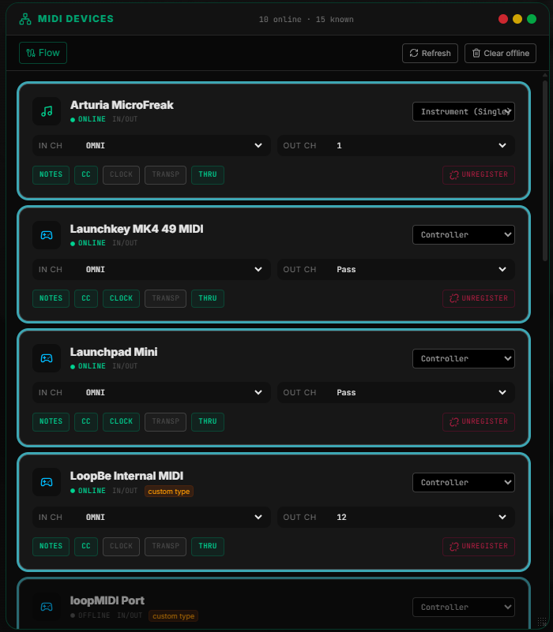

# MIDI DEVICES

Open the **Devices** from the Main Page.

The panel lists every MIDI port detected by the Web MIDI API — inputs and outputs — grouped by physical device. Each card shows:

| Field | Meaning |
|--------|---------|
| **Name** | Port name as reported by the OS / driver |
| **Type** | Auto-classified: Controller · Instrument (Single) · Instrument (Multi) · Audio Interface — click the type dropdown to override it; your choice is saved immediately as a "custom type" |
| **Status** | Online (green) or Offline (gray) |
| **IN/OUT** | Which directions this port supports |

Use **Refresh** (top-right) to re-scan the Web MIDI API without reloading the page, and **Clear offline** to drop any disconnected devices from the list.

### If your device is not listed

- Click **Refresh**.
- Unplug and re-plug the USB cable, wait 3 seconds, then refresh again.
- Make sure no other application (DAW, standalone synth editor) has taken exclusive ownership of the port.

### Register the device

Click **Add to routing** on a device's card. This moves it into the routing matrix so it appears in MIDI FLOW and everywhere else routing is configured. Registered devices persist across sessions — you only need to do this once per device. A registered device's card gets a cyan ring and expands with:

| Control | Description |
|---|---|
| **IN CH** | Input channel filter — OMNI or 1–16 |
| **OUT CH** | Output channel remap — Pass (unchanged) or 1–16 |
| **Notes / CC / Clock / Transp / Thru** | Toggle which message types flow to/from this device |
| **Unregister** | Removes the device from the routing matrix (the port itself stays listed if still connected) |

---

## Virtual Instruments

A separate section below the device list for instruments that aren't a real MIDI port — e.g. a software synth reachable only through a virtual MIDI cable driver (IAC Bus, loopMIDI, etc.).

- **Add Virtual Instrument** prompts for a name only. The instrument appears immediately as a registered, routable source/destination — no port needs to be chosen up front.
- **Output port** — each virtual instrument card has its own dropdown selecting which real MIDI output physically carries its data (e.g. the loopMIDI port your soft synth listens on). Leave it at **— None —** and the instrument's messages go nowhere. This same setting can also be changed from the instrument's node card on the [MIDI Flow](./SYCORE_MIDI_FLOW.md) canvas — both controls update the same value.
- **Remove** deletes the virtual instrument and its registration.

For a virtual instrument that's itself multi-timbral (multiple parts across multiple MIDI channels), configure **Multi-CH out** on its node in MIDI Flow to duplicate outgoing notes onto several channels at once — see [MIDI Flow → Virtual Instrument Configuration](./SYCORE_MIDI_FLOW.md#virtual-instrument-configuration).

### Multiple virtual instruments, same target

Only the **name** has to be unique — nothing stops two (or more) Virtual Instruments from pointing at the same **Output port**, i.e. the same standalone app or the same virtual MIDI cable. This is the normal way to work with one multitimbral app: instead of a single "Instrument" entry covering all its parts, add one Virtual Instrument per part (e.g. `Synth — Lead`, `Synth — Bass`, `Synth — Pad`), point every one of them at that app's single Output port, and give each its own default channel, program, and [CC Table](#cc-table) below. Each part then shows up as its own routable source/destination and its own row in MIDI Flow, even though they all physically go out the same cable.

### CC Table

Click **CC Table** on a Virtual Instrument's card to open its named-CC editor. Use it to label any CC number the instrument responds to (e.g. `74` → `Cutoff`, `71` → `Resonance`) — **Add CC** inserts a row, each row takes a CC number (0–127, no duplicates within the table) and a free-text name, and the trash icon removes a row.

Named entries appear immediately in [MIDI Controller Designer](./SYCORE_MIDI_CONTROLLER_DESIGNER.md)'s action picker, grouped under `Virtual: <instrument name>`, ready to assign to any physical knob/fader — turning that control then sends the named CC straight to the instrument. Because one CC table is shared across a multitimbral instrument's channels, the picker itself is channel-less; the **Target Channel** you pick at assignment time (defaulting to the instrument's own configured channel) is what's actually sent, so the same named CC entry can be assigned to different physical controls targeting different channels/parts.

---

Click the button **FLOW** to connect your devices

[<button class="border px-8 py-2 border-neutral-700 rounded m-auto hover:bg-synth-neon bg-synth-neon/50">Next MIDI FLOW</button>](./SYCORE_MIDI_FLOW.md)
