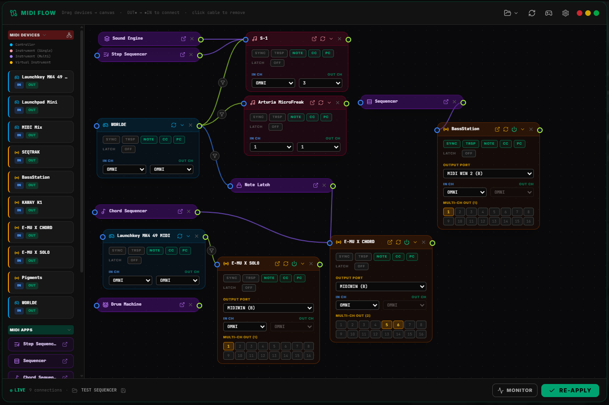

# MIDI Flow

**Purpose:** Visual, drag-and-drop MIDI routing canvas for connecting virtual apps and hardware devices — including device→app and app→app input routing.

---

## Overview

The MIDI Flow panel provides a graphical canvas to build your MIDI routing topology. Drag sources from the sidebar, drop them onto the canvas, and connect them by drawing cables between ports. Routing applies **live** — every change is committed to the store automatically, no separate "apply" step required.

---

## Sidebar

The sidebar has two collapsible sections. Click a section header to expand/collapse it (chevron indicates state).

### MIDI Devices

All registered hardware/virtual devices from `midiStore.routingConfig.registrations`, color-coded by type:

| Type | Color |
|---|---|
| Controller | Sky blue |
| Instrument (Single) | Rose |
| Instrument (Multi) | Violet |
| Virtual Instrument | Amber |

Each device shows **IN**/**OUT** capability badges and has both an OUT port and an IN port on the canvas.

### MIDI Apps (Virtual Sources)

| App | Source ID | Has IN |
|---|---|---|
| Step Sequencer | `SEQUENCER` | ✓ |
| Sequencer (Piano Roll) | `SEQUENCER2` | ✓ |
| Chord Sequencer | `CHORD_PROG` | ✓ |
| Piano Roll (MIDI Capture) | `MIDI_CAPTURE` | ✓ |
| Virtual Keyboard | `KEYBOARD` | ✓ |
| Arpeggiator | `ARP` | ✓ |
| Transport / Clock | `TRANSPORT` | |
| Sound Engine | `UI` | |
| Drum Machine | `DRUM_MACHINE` | ✓ |
| Sampler | `SAMPLER` | ✓ |
| Note Latch | `NOTE_LATCH` | ✓ |

Every app has an **OUT** port. Apps marked "Has IN" also expose an **IN** port, so they can receive routed MIDI from a device or from another app (e.g. Chord Sequencer OUT → Virtual Keyboard IN).

---

## Canvas

Drop sidebar items onto the dot-grid canvas. Each dropped item becomes a movable node card:

- **App nodes** — purple-toned cards with the app icon, an OUT port, and an IN port if the app accepts input
- **Device nodes** — color-coded cards (by device type) with device name, IN port (left), OUT port (right), flag toggles, and channel selectors. Hardware device nodes with an input show a **↺ reconnect** button in the header — click it to force-close and reopen the Web MIDI port and re-attach the ingress listener, fixing stale connections after a page reload.

Each app node's header also has an **open-app** shortcut (external-link icon) that jumps straight to that app's panel. Instrument device nodes (Instrument Single/Multi and Virtual Instrument — not Controllers) get the same icon, but it opens the **Device Program Change** panel pre-selected to that device instead. Every node's header also has the **X** button to remove it, or click the **collapse icon** to minimize the node to header-only, saving canvas space while keeping the node present and wired.

### Building Connections

1. **OUT port** → **IN port**: click and drag from a node's green OUT dot (right side) to another node's blue IN dot (left side)
2. A dashed bezier preview follows the cursor while dragging
3. Cables are colored by connection type:
   - **Lime** (`#a3e635`) — device to device
   - **Blue** (`#3b82f6`) — device to app (device→app input routing)
   - **Purple** (`#8b5cf6`) — app to app (app→app input routing)
4. A dashed cable indicates a device→app or app→device connection with an active note-range filter

### Note-Range Filters (Keyboard Split)

Click any device→app or app→device cable to open its note-range popover. Set **Low**/**High** (0–127) to restrict which notes flow through that connection — e.g. split one keyboard so the low half feeds the Drum Machine and the high half feeds the Step Sequencer. Leaving the full 0–127 range means no filtering. App→device cables also support this filter, so a sequencer output can be restricted to a specific note range before reaching its destination.

### MIDI Channels Filter

Click any cable's filter icon to select which MIDI channels pass through the connection. Works for device→device, device→app, and app→device cables. The filter gates on the output channel (after remapping), so selecting CH 2 sends to the destination on CH 2 regardless of the source channel. With no channels selected (default), no filter is applied and all channels pass through.

This is useful for connecting a keyboard split to drive different sounds on different channels from the same keyboard, or for restricting a sequencer's output to specific instrument channels.

### Removing Connections

Click on any cable to delete it (or open its note-range popover and use the remove action). An invisible wide hit-area path makes clicking easy.

### Removing Nodes

Click the **X** button on a node card to remove the node along with all its connected cables and any input-routing entries tied to it.

---

## Per-Device Configuration

Hardware device nodes expose inline controls:

| Control | Options |
|---|---|
| **SYNC** | Toggle MIDI clock sync on this device |
| **TRSP** | Toggle transport (Start/Stop/Continue) messages |
| **NOTE** | Toggle note on/off messages |
| **CC** | Toggle control change messages |
| **PC** | Toggle program change messages |
| **IN ch** | Input channel: OMNI or 1–16 |
| **OUT ch** | Output channel: OMNI or 1–16 |

---

## Virtual Instrument Configuration

Virtual Instrument nodes get two extra controls beyond the standard device controls above, since a virtual instrument isn't a real WebMIDI port:

| Control | Description |
|---|---|
| **Output port** | The real MIDI output that physically carries this virtual instrument's data. Also editable from [MIDI Devices](./SYCORE_MIDI_DEVICES.md)'s Virtual Instruments list — both controls update the same setting. |
| **Multi-CH out** | A 16-button channel grid for multi-timbral fanout — select any combination of channels (e.g. 1, 2, 4) to duplicate every outgoing note/CC/PC onto all of them at once, instead of a single channel. Useful for a virtual multi-instrument rack where several parts should sound together from one source (e.g. Chord Sequencer OUT feeding three layered parts). When at least one channel is selected here, it overrides the regular **OUT ch** selector above (shown disabled while overridden). Leave empty to fall back to OUT ch's single-channel behavior. |

### What can I add as a Virtual Instrument?

A Virtual Instrument could be a standalone app (a synth typically) that accept MIDI Messages and can configure a MIDI Input port. It can be also a multipart (up to 16 MIDI channels) that SY.CORE can manage. 

**In order to have the MIDI routing working correctly the MIDI IN of your app has to be the same of the MIDI output set in SY.CORE.**

### Multi-Channel Conflict Guard

When two canvas nodes point to the same virtual instrument, the second node's Multi-CH panel is locked with an explanation, and the routing engine preserves the first node's channel assignments instead of overwriting them. Stale saved configs where both nodes had channels are auto-corrected on load.

---

## Per-Instrument Note Latch

Each hardware or virtual instrument node now has a **LATCH** row in its canvas card. Toggle ON to hold notes after key release.

| Control | Range | Description |
|---------|-------|-------------|
| **LATCH toggle** | ON / OFF | Enables/disables note latching for this instrument. Right-click to MIDI Learn. |
| **Max** | 1–16 | Maximum number of held notes. When the buffer is full: |
| **Mode** | FIFO / BLOCK | **FIFO** ejects the oldest held note when full; **BLOCK** rejects new notes until one is released. |

The per-device latch is independent of the global SmartLatch and applies to both keyboard Thru and all app-generated notes (sequencer, chord progressions, etc.). Right-click any control to MIDI Learn. Settings are persisted per device.

## Saved Configurations

Use the **folder** button in the header to save, load, overwrite, or delete named canvas snapshots (nodes + cables):

- **Save** the current canvas under a new name
- Click a saved entry to **load** it — replaces the current canvas
- Hover an entry for **overwrite** (save icon) and **delete** (trash icon) actions
- The footer shows the currently loaded configuration name with a quick overwrite button
- The last loaded/saved configuration is remembered and automatically reloaded the next time MIDI Flow opens

---

## Live Routing

Routing changes apply automatically as you build the canvas — the footer's **Live** indicator confirms this. The **Re-apply** button forces a manual re-sync if needed, and the header **Reload** button (`RefreshCw`) re-reads the current store state and rebuilds the canvas from scratch, discarding unsaved canvas edits.

---

## Controller Designer

The header **CPU** button toggles the MIDI Controller Designer panel, accessible alongside the MIDI Flow canvas for a complete routing and control-mapping workflow.
