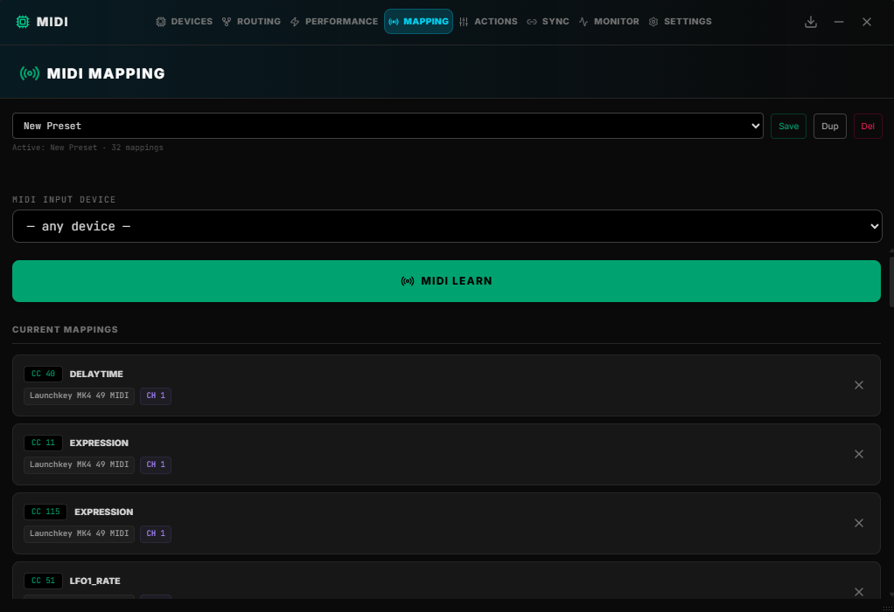

 # Mapping 



**Purpose:** MIDI CC → application parameter mapping with preset management.

**MIDI Learn workflow:**

- Press **MIDI LEARN** → raw listener attached via `midiService.addRawListener()`.
- Move a physical knob/fader → CC number, device name, and channel are detected and displayed.
- Select a target parameter from the dropdown (S-1 hardware parameters + registered configStore params, deduplicated and sorted).
- Press **Confirm Mapping** → stored in `mappingStore.midiMappings`.


**Preset management:**

- Named presets stored in `mappingStore`. CRUD: save, load, duplicate, delete.
- Active preset shown with mapping count.

**Mapping entry format:**

```ts
{ cc: number, paramName: string, device: string, channel: number }
```

**Parameter sources merged into the dropdown:**

| Source | Category label |
|---|---|
| `S1_CC_MAP` constants | `S-1 HARDWARE` |
| `configStore.midiConfig` entries | `REGISTERED` or entry-provided category |
