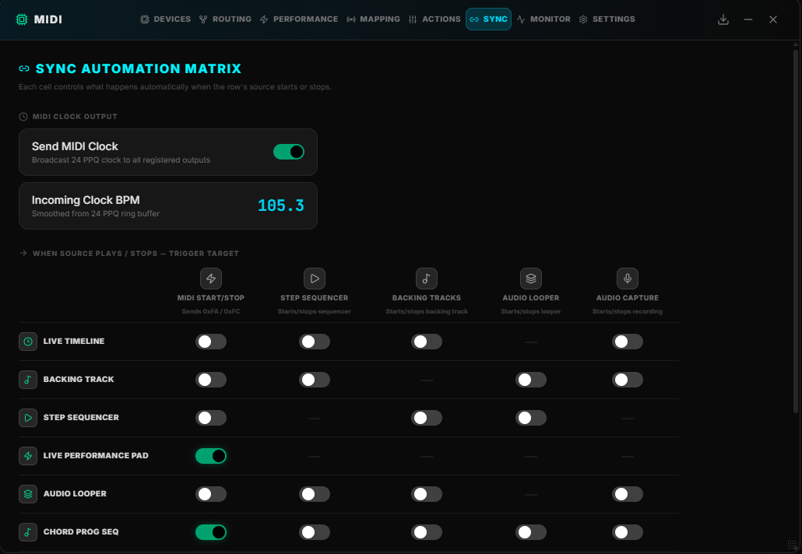

# MIDI SYNC

**Purpose:** Cross-subsystem transport synchronization matrix — which playback sources trigger which other playback targets when started/stopped.

**Matrix structure (rows = trigger sources, columns = targets):**

Each cell is an independent boolean toggle. Enabling a cell means "when this row's transport changes state, also trigger the column's transport." `null` cells (self-sync) are rendered as N/A and are not interactive.
