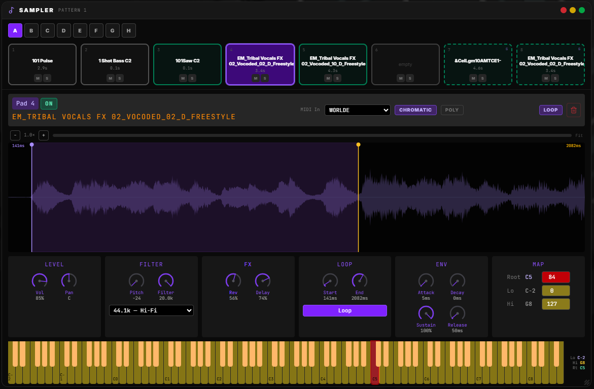
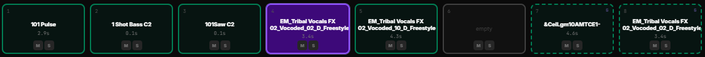
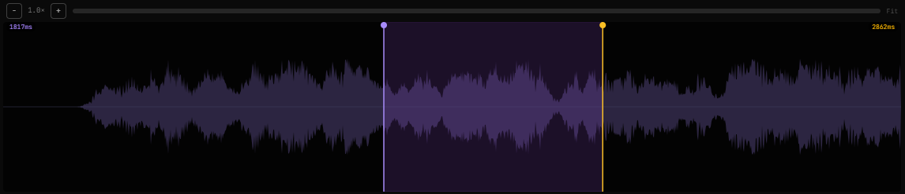
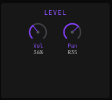
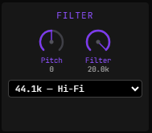
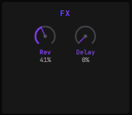
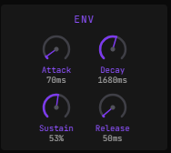
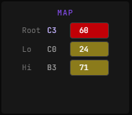
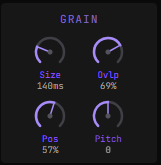

# Sampler

The **Sampler** is an 8-pad, multi-bank sample player with MIDI velocity, chromatic pitch-shifting, polyphonic voice management, per-pad ADSR envelopes, lo-fi downsampling, dual granular synthesis (pads 7 & 8), and full MIDI input filtering. Sounds are loaded from local files or injected directly from the Freesound Browser.

---

## Opening the Panel

| Method | Action |
|--------|--------|
| **Footer** | Click the :Music2: **Sampler** button |
| **Main Menu Dial** | Select **Sampler** from the menu |
| **Sidebar** | Click the Sampler entry |

The panel opens as a floating, **draggable and resizable** window (initial 720 × 460 px, minimum 520 × 300 px). Drag the header bar to reposition; drag the bottom-right corner to resize. Position and size persist across sessions.

---

## Banks A–H

Eight independent pattern banks (**A–H**) each hold 8 pads with completely separate sound assignments and settings. Click a bank letter to switch instantly.

> Switching banks resets all arm, mute, and solo states for the incoming bank.

---

## The Pad Grid

8 pads are arranged in a horizontal row. Pads 7 and 8 (indices 6 & 7) are **Granular pads** (marked **G**) and have extra grain controls when selected.

> **Note:** Banks created before the 8-pad update may have pad 7 as granular too. Both pads are styled identically (dashed border, **G** label).

| Pad state | Visual |
|-----------|--------|
| **Empty** | Dark border, "empty" label — hover to reveal **+ load** |
| **Loaded** | Sample name + duration displayed |
| **Armed** | Green border — responds to incoming MIDI notes |
| **Playing** | Violet glow |
| **Selected** | Orange tint + violet ring — detail panel shown below |

### Loading & Selecting a Sample

- **Click an empty pad** → selects it. Hover and click **+ load** to open the Sound Folder Browser and pick an audio file.
- **Click a loaded pad** → selects it and opens the detail panel — does **not** toggle arm status.
- **Right-click any pad** → opens the MIDI context menu for mapping.
- **Freesound Browser** → search and assign directly; the pad receives the sound via the `sampler-pad-assign` event.

Root key is auto-detected from the filename (e.g. `Piano_C4.wav` → MIDI 72).

### Mute / Solo

Each pad has **M** (mute) and **S** (solo) buttons in its lower area.

| Button | Colour when active | Behaviour |
|--------|--------------------|-----------|
| **M** | Yellow | Silences the pad; stops playback immediately if the pad is active |
| **S** | Cyan | Solos the pad; all non-soloed pads that are currently playing are stopped |

Multiple pads can be soloed simultaneously.

---

## Pad Detail Panel

Click any loaded pad to select it and reveal the detail strip below the grid. Six (or seven for granular pads) control sections are shown side by side.

### Header Row

| Control | Description |
|---------|-------------|
| **Pad number / label** | Shows the pad index and sample name |
| **ON/OFF** | Toggle — arms or disarms the pad for MIDI input. Green = armed, neutral = off |
| **MIDI In** | Dropdown — filter incoming MIDI to a specific hardware controller (by device ID) or leave on **All controllers** |
| **Chromatic** | Toggle — when on, pitch follows the incoming MIDI note relative to the pad's Root key; when off, only the exact Root key triggers the pad |
| **Poly** | Toggle — when on, multiple simultaneous notes are tracked independently per pad; when off, a new note stops the previous one |
| **Clear** | Unloads the sample and resets the pad |

### Waveform

### Level

| Knob | Range | Default | Notes |
|------|-------|---------|-------|
| **Vol** | 0–100% | 85% | Multiplied by MIDI velocity at trigger time |
| **Pan** | L100–C–R100 | C | Stereo position |

### Filter

| Control | Range | Default | Notes |
|---------|-------|---------|-------|
| **Pitch** | −24 to +24 semitones | 0 | Static pitch offset (on top of chromatic shift) |
| **Filter** | 80 Hz–20 kHz | 20k (open) | Low-pass filter cutoff |
| **Sample rate** | 44.1k / 22k / 14.7k / 11k / 8k | 44.1k | Lo-fi downsampling; lower rates are pre-warmed on change |

Lo-fi sample rate options and their character:

| Value | Label |
|-------|-------|
| 44 100 Hz | Hi-Fi |
| 22 050 Hz | Cassette |
| 14 700 Hz | Lo-Fi |
| 11 025 Hz | Crunch |
| 8 000 Hz | Phone |

### FX

| Knob | Range | Default |
|------|-------|---------|
| **Rev** | 0–100% | 0% |
| **Delay** | 0–100% | 0% |

Send levels to the shared reverb and delay buses.

### Loop

| Control | Range | Default | Notes |
|---------|-------|---------|-------|
| **Start** | 0–100% | 0% | Playback start point within the buffer |
| **End** | 0–100% | 100% | Playback end point |
| **Loop** button | on/off | off | Loops the region between Start and End |

### ENV (ADSR)

| Knob | Range | Default |
|------|-------|---------|
| **Attack** | 0–2 s | 5 ms |
| **Decay** | 0–3 s | 0 ms |
| **Sustain** | 0–100% | 100% |
| **Release** | 0–3 s | 50 ms |

The envelope is applied to every triggered note. Decay ramps to the Sustain level. Release fires on Note OFF (or when a monophonic note is replaced).

### MAP (MIDI Key Range)

| Field | MIDI range | Default | Notes |
|-------|-----------|---------|-------|
| **Root** | 0–127 | 72 (C4) | Reference pitch for chromatic shift; auto-detected from filename |
| **Lo** | 0–127 | 0 | Minimum MIDI note that triggers this pad |
| **Hi** | 0–127 | 127 | Maximum MIDI note that triggers this pad |

Notes outside Lo–Hi are ignored even when the pad is armed.

### Grain (Pads 7 & 8 — indices 6 & 7)

Pads 7 and 8 use a granular engine. When selected, four additional knobs appear:

| Knob | Range | Default | Notes |
|------|-------|---------|-------|
| **Size** | 20–500 ms | 100 ms | Individual grain duration |
| **Ovlp** | 0–95% | 50% | Grain overlap (density) |
| **Pos** | 0–100% | 50% | Read position within the buffer |
| **Pitch** | −24 to +24 semitones | 0 | Grain pitch offset |

Tweaking any grain parameter while the pad is playing restarts the granular cloud immediately.

---

## MIDI Triggering

1. **Arm a pad** — select the pad, then toggle **ON** in the detail panel header (green = armed).
2. Play a MIDI note within the pad's Lo–Hi key range on the selected controller.
3. Velocity scales the pad volume proportionally.
4. In **Chromatic** mode, pitch shifts by the interval between the incoming note and the Root key.
5. **Note OFF** (or velocity-0 Note ON) triggers the release envelope and stops the sound.

> **Arming:** Clicking a pad only selects it — arm status is controlled exclusively via the **ON/OFF** toggle in the detail panel header or via MIDI mapping.

In **Poly** mode each note is tracked separately; overlapping notes fade out independently on Note OFF.

---

## Integration with Freesound Browser

Open the Freesound Browser, find a sound, and use **Assign to Sampler Pad** to route it directly to any pad in any bank. The pad receives the IDB blob URL without requiring a manual file load.

---

## Tips

- **Auto root key** — include the note name in your filename (`Kick_D2.wav`) and the sampler sets Root automatically.
- **Stack banks for a set** — load different kits into A–H and switch banks between songs.
- **Lo-fi layering** — run two pads with the same sample at different sample rates for a layered texture.
- **Dual granular pads** — pads 7 and 8 are both granular. Use one for sustained textures and the other for glitchy rhythmic grains, or layer both for dense ambient clouds.
- **Pad 7 as texture** — use the granular pads for sustained pads or ambient textures while the other six handle one-shots.

---

*Last updated: 2026-07-15*
